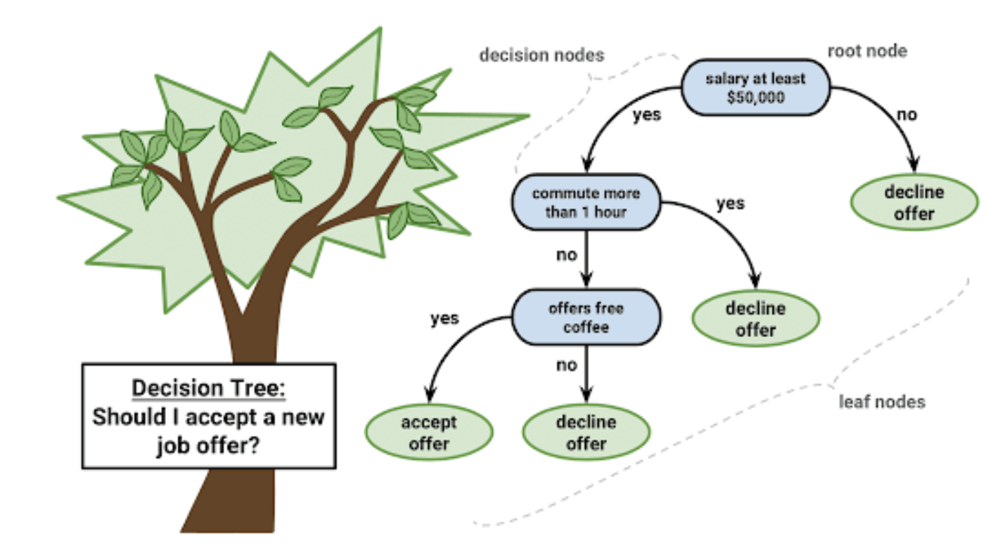

- [Feature Engineering: Preprocessing and Transformation](#feature-engineering-preprocessing-and-transformation)
  - [Preprocessing](#preprocessing)
    - [Scaling](#scaling)
    - [Data Leakage](#data-leakage)
    - [Use pipeline](#use-pipeline)
  - [Transformations](#transformations)
    - [Encoding for Categorical Features](#encoding-for-categorical-features)
      - [Overeview](#overeview)
      - [`OneHotEncoder` and `ColumnTransformer`](#onehotencoder-and-columntransformer)
      - [Target-Based Encoding](#target-based-encoding)
    - [Non-linear transformation](#non-linear-transformation)
    - [Discretization](#discretization)
    - [Imputation](#imputation)
- [Linear Models](#linear-models)
  - [Linear Regression](#linear-regression)
    - [LR(OLS)](#lrols)
    - [Ridge(L2) Regression](#ridgel2-regression)
    - [Statistical view of LR and RR.](#statistical-view-of-lr-and-rr)
    - [Lasso(L1) Regression](#lassol1-regression)
    - [ElasticNet](#elasticnet)
    - [Regression Analysis](#regression-analysis)
    - [Regression Model Evaluation](#regression-model-evaluation)
  - [Logistic Regression](#logistic-regression)
    - [Overeview](#overeview-1)
    - [Q&A](#qa)
- [SVM](#svm)
  - [Overeview](#overeview-2)
  - [Max-Margin and Support Vectors](#max-margin-and-support-vectors)
  - [Soft Margin Linear SVM](#soft-margin-linear-svm)
  - [Kernel SVM](#kernel-svm)
  - [Multiclass Classification for SVM](#multiclass-classification-for-svm)
    - [One vs Rest (OVR)](#one-vs-rest-ovr)
    - [One vs One (OVO)](#one-vs-one-ovo)
    - [Multinomial Logistic Regression](#multinomial-logistic-regression)
  - [`scikit-learn` implementation](#scikit-learn-implementation)
    - [Computational Considerations (for all linear models)](#computational-considerations-for-all-linear-models)
  - [SVM or LogReg?](#svm-or-logreg)
    - [Q&A](#qa-1)
- [Bayes Models](#bayes-models)
- [KNN](#knn)
  - [Overeview](#overeview-3)
- [Trees & Ensemble](#trees--ensemble)
  - [Decision Tree](#decision-tree)
    - [Overeview](#overeview-4)
    - [Algorithms Implementation(ID3, C4.5, CART)](#algorithms-implementationid3-c45-cart)
    - [Classification Tree](#classification-tree)
    - [Regression Tree](#regression-tree)
    - [Tree Visualization](#tree-visualization)
    - [Hyper-Parameters Tuning](#hyper-parameters-tuning)
    - [Relation to KNN](#relation-to-knn)
    - [Feature Importance](#feature-importance)
    - [Q&A](#qa-2)
  - [Ensemble](#ensemble)
    - [VotingClassifier](#votingclassifier)
    - [Bagging](#bagging)
    - [Random Forest](#random-forest)
      - [Randomize in two ways](#randomize-in-two-ways)
      - [Tuning Random Forests](#tuning-random-forests)
      - [Warm-Starts](#warm-starts)
      - [Out-Of-Bag estimates: OOB score](#out-of-bag-estimates-oob-score)
      - [Feature Importances](#feature-importances)
- [Boosting](#boosting)
  - [Boosting in General](#boosting-in-general)
  - [Gradient Boosting Algorithm](#gradient-boosting-algorithm)
    - [GradientBoostingRegressor](#gradientboostingregressor)
    - [GradientBoostingClassifier](#gradientboostingclassifier)
    - [Gradient Boosting Advantages](#gradient-boosting-advantages)
    - [Tuning Gradient Boosting](#tuning-gradient-boosting)
    - [Q&A](#qa-3)
  - [*XGBoost](#xgboost)
    - [Overeview](#overeview-5)
    - [Recap](#recap)
    - [Objective Function](#objective-function)
    - [Tree Model Parameterization](#tree-model-parameterization)
      - [Tree definition](#tree-definition)
      - [Define Complexity of a Tree](#define-complexity-of-a-tree)
    - [*Spliting Algorithm](#spliting-algorithm)
    - [Engineering Details](#engineering-details)
    - [Summary](#summary)
  - [LightGBM](#lightgbm)
  - [Summary of Tree Models](#summary-of-tree-models)
- [Probabilistic Graphical Model](#probabilistic-graphical-model)
  - [Overeview](#overeview-6)
  - [Bayesian Model](#bayesian-model)
    - [Overeview](#overeview-7)
    - [Bayesian network](#bayesian-network)
    - [Naive Bayes](#naive-bayes)
  - [Discriminative Model vs Generative Model](#discriminative-model-vs-generative-model)
  - [Markov](#markov)
    - [Overeview](#overeview-8)
    - [Markov Model(Process)](#markov-modelprocess)
    - [HMM(Hidden Markov Model)](#hmmhidden-markov-model)
    - [Markov Network](#markov-network)
    - [CRF](#crf)
  - [Topic Model](#topic-model)
- [Dimension Reduction](#dimension-reduction)
- [Model Evaluation](#model-evaluation)
  - [**Metrics](#metrics)
    - [Metrics for Binary Classification](#metrics-for-binary-classification)
      - [Confusion Matrix](#confusion-matrix)
      - [Precision-Recall Curve](#precision-recall-curve)
      - [F1 vs Average Precision](#f1-vs-average-precision)
      - [ROC Curve](#roc-curve)
      - [Summary](#summary-1)
    - [Metrics for Multi-class Classification](#metrics-for-multi-class-classification)
      - [Averaging Strategies](#averaging-strategies)
      - [Built-in Scoring](#built-in-scoring)
    - [Metrics for Regression](#metrics-for-regression)
      - [Overeview](#overeview-9)
    - [Metrics in NLP](#metrics-in-nlp)
    - [Metrics in Recommender System](#metrics-in-recommender-system)
      - [HR(Hit Rate)](#hrhit-rate)
      - [NDCG](#ndcg)
  - [Calibration](#calibration)
    - [Overeview](#overeview-10)
    - [Calibration curve (Reliability diagram)](#calibration-curve-reliability-diagram)
    - [`Brier Score` (for binary classification)](#brier-score-for-binary-classification)
    - [Fixing it: Calibrating a classifier](#fixing-it-calibrating-a-classifier)
      - [Platt Scaling](#platt-scaling)
      - [Isotonic Regression](#isotonic-regression)
- [Imbalanced Data](#imbalanced-data)
  - [Intro](#intro)
  - [Two Basic Approaches](#two-basic-approaches)
    - [Random Undersampling](#random-undersampling)
    - [Random Oversampling](#random-oversampling)
  - [Class Weights in Loss Functions](#class-weights-in-loss-functions)
  - [Other methods](#other-methods)
  - [Synthetic Minority Oversampling Technique (SMOTE)](#synthetic-minority-oversampling-technique-smote)
    - [Overeview](#overeview-11)

<br>

# Feature Engineering: Preprocessing and Transformation
- [Feature Engineering Example](https://mp.weixin.qq.com/s/8Q28WOVqknw0OEcGMzV-Ow)
## Preprocessing

### Scaling

Here's an illustration of four of the most common ways


<br>

- **StandardScaler**: 
  - It **subtracts the mean and divides by standard deviation**. Making all the features have a zero mean and a standard deviation of one.
  - 
  - **Cons**: it won't guarantee any minimum or maximum values. The range can be arbitrarily large.
- **MinMaxScaler**: 
  - It **subtracts minimum and divides by range**. Scales between 0 and 1. 
  - So all the features will range from ==[0, 1]==. 
  - This mostly makes sense **if there are actually minimum and maximum values in your data set**. If it's actually Gaussian distribution, the scaling might not make a lot of sense, because if you add one more data point, it's very far away and it will cram(squeeze) all the other data points more together. This will make sense if you have a grayscale value within ==[0, 255]== or something else that has like clearly defined boundaries. 
- **RobustScaler**.: 
  - It’s the robust version of the ==**StandardScaler**==. It computes the ==median== and the ==qurtiles==. 
  - $X = \frac{X- X~median~}{p~75~ - p~25~}$
  - **Cons** : This **cannot be skewed by outliers**. The StandardScaler uses ==**mean**== and ==**standard deviation**== . So if you have a point that’s very far away, it can have unlimited influence on the mean. The ==**RobustScaler**== uses robust statistics, so it’s not skewed by outliers. 
- **Normalizer**: 
  - It makes sure that vectors have length one either in ==L1== norm or ==L2== norm. 
    - If you do this for ==L2== norm, it means you don't care about the length you project on a **circle**. 
    - More commonly used in ==L1== norm, it projects onto the **diamond**. It means you make sure **the sum of all the entries is one**. That's often used if you have histograms or if you have counts of things. If you want to make sure that you have frequency features instead of count features, you can use the ==L1== normalizer.
    - designed for the row (sample) not cols (features), **typically used for (word) embeddings**
    - The goal is to make sure, when calculate the dot product between features, they will have the similar range, ie, onvert to ==unit vectorc==. 

**Sparse Data** 

- Data with many zeros: only store non-zero entries. - **Hash Encoding**
- Subtracting anything will make the data **“dense”** (no more zeros) and **blow the RAM**.
- Only scale, don’t center: ==MaxAbsScaler==
  - ==MxAbsScaler== sets the maximum absolute values to one. 
  - Basically, it looks at the maximum absolute values for each feature and just scale each feature by divided by the maximum absolute value

**Standardization**: mean removal and variance scaling
- ML model might behave badly if the individual features do not more or less look like standard normally distributed data: **Gaussian with zero mean and unit variance**
- For instance, many elements used in the objective function of a learning algorithm (such as the ==RBF kernel of SVM== or the ==L1== and ==L2== regularizers of linear models) **assume that all features are centered around zero and have variance in the same order**. If a feature has a **variance that is larger than others**, it might **dominate the objective function** and make the model unable to learn from other features correctly as expected.
```python
from sklearn.preprocessing import StandardScaler
StandardScaler().fit_transform(data)
```
- Models that need Standardization: Adaboost, SVM, LR, KNN, KMeans
- Models that don't need Standardization: DTree, RandomForest
  - For Tree models, value exploding or vanishing don't affect the split position, because every step is based on feature values, even though we standardize or not, the ranking of the features won't change, so that split position won't change
  

<br>

### Data Leakage


<br>

- What’s shown on the **left**: we trained the ==scaler== on the training data, and then applied cross-validation to the scaled data.
  - The problem is that we use the information of all of the training data for scaling, so in particular **the information in the validation fold**. This is also known as **data leakage**. 
  - If we apply our model to new data, this data will not have been used to do the scaling, so our **cross-validation will give us a biased result that might be too optimistic**.
- On the **right**: this how we should do
  - we should only use the training part of the data to find the ==mean== and ==standard deviation==, **even in cross-validation**. 
  - That means for each split in the cross-validation, we need to scale the data a bit differently. This basically means **the scaling should happen inside the cross-validation loop**, not outside.
- In practice, estimating the mean and standard deviation is quite robust and you will not see a big difference between the two methods. **But for other preprocessing steps** that we’ll see later, this might make a huge difference. So we should get it right from the start.

### Use pipeline
- [scikit-learn : make_pipeline function](https://scikit-learn.org/stable/modules/generated/sklearn.pipeline.make_pipeline.html)
- [scikit-learn : Pipeline function](https://scikit-learn.org/stable/modules/generated/sklearn.pipeline.Pipeline.html)


<br>

- Here is an illustration of what happens with three steps, ==T1==, ==T2== and ==Classifier==. 
- Imagine T1 to be a ==scaler== and T2 to be any other transformation of the data. If we call fit on this ==pipeline==
  - it will first call `fit` on the first step with the input `X`. 
  - Then it will transform the input `X` to `X1`, and use `X1` to fit the second step, `T2`. 
  - Then it will use `T2` to transform the data from `X1` to `X2`. 
  - Then it will fit the classifier on `X2`. 
- If we call predict on some data `X’`, say the `test set`
  - it will call transform on `T1`, creating `X’1`. 
  - Then it will use `T2` to transform `X’1` into `X’2`, 
  - Then, call the predict method of the `classifier` on `X’2`. 
- **How does that help with the ==cross-validation== problem?** 
  - Because now all steps are contained in pipeline, we can simply pass the whole pipeline to cross-validation, and **all processing will happen inside the cross-validation loop**(that’s exactly what we want, which solves the data leakage problem!). 
  - Here you can see how we can build a pipeline using a `standard scaler` and `kneighborsregressor` and pass it to `cross-validation`.

```python
from sklearn.pipeline import make_pipeline, Pipeline
from sklearn.neighbors import KNeighborsRegressor

knn_pipe = make_pipeline(StandardScaler(), KNeighborsRegressor())
scores = cross_val_score(knn_pipe, X_train, y_train, cv=10)
print(np.mean(scores), np.std(scores))

pipe = Pipeline((("scaler", StandardScaler()),
                 ("regressor", KNeighborsRegressor))
                )
# The pipeline can be used as any other estimator and avoid leaking the test set to train set
pipe.fit(X_train, y_train)
pipe.score(X_test, y_test) 
#Call transform of each transformer in the pipeline. The transformed data are finally passed to the final estimator that calls score method. Only valid if the final estimator implements score.
```

<br>

## Transformations
### Encoding for Categorical Features
- More encodings for categorical features: http://contrib.scikit-learn.org/categorical-encoding/

#### Overeview
- ==one-hot(dummy) encodin==: no order within the feature，==#category < 4==; 
  - For **high-cardinality** categorical feature, 编码之后特征空间过大（可以考虑PCA降维），而且由于one-hot feature 比较unbalanced，树模型里每次的切分增益较小，树模型通常需要grow very deep才能得到不错的精度
  - In more practical use cases, especially NN related cases, people would typically use **one-hot + encoders** to project the one hot encoder into low dimensional dense space. 
    - For instance, classical **word2vec** embedding use a reconstruction task to train a low dimensional representation of word one-hot vector. 
    - Another way is like LDA and ==GloVE==, to use a global co-occurance information combined with PCA/SVD method to reduce the dimension.
      - GloVE is an **unsupervised** learning algorithm developed by Stanford for generating word embeddings by aggregating global word-word co-occurrence matrix from a corpus.The objective function minimizes the difference between (how related are two words) with (how often they appear near each other)
- ==label encoding==: have order within the feature(ordinal feature)
- ==target encodin== (mean encoding, likelihood encoding, impact encoding): no order within the feature，==#category > 4==
- 不做处理 (模型自动编码: `CatBoost`, `lightgbm`):
  - `XgBoost` 和 `Random Forest`，不能直接处理 `categorical feature`，必须先编码成为 `numerical feature`
  - `lightgbm` 和 `CatBoost，可以直接处理` `categorical feature`。
    - `lightgbm` :需要先做 `label encoding`, 用特定算法（On Grouping for Maximum Homogeneity）找到optimal split，效果优于ONE。也可以选择采用`one-hot encoding`
    - `CatBoost`: 不需要先做 `label encoding`, 可以选择采用 `one-hot encoding, target encoding (with regularization)`

#### `OneHotEncoder` and `ColumnTransformer`
- https://scikit-learn.org/stable/modules/generated/sklearn.compose.make_column_transformer.html
- https://scikit-learn.org/stable/modules/generated/sklearn.compose.ColumnTransformer.html

**Intro**:
- `ColumnTransformer` allows you to **transform only some of the columns**

- This uses the column information in `pandas dataframe` and allows you to slice out different columns based on column names:
  - (1) integer indices
  - (2) boolean masks
  
- Below is a schematic of the `ColumnTransformer`. Most commonly you might want to separate `continuous` and `categorical` columns,
  - you can select any subsets of columns you like
  
  - they can also overlap
  
  - Or you can apply multiple transformations to the same set of columns. 
    - Let's say I want a scaled version of the data, but I also want to extract principal components (PCA). I can use the same column as inputs to multiple transformers, and the results will be concatenated.
    
    
    
    

<br>
<br>

```python
from sklearn.preprocessing import StandardScaler, OneHotEncoder
from sklearn.compose import make_column_transformer
from sklearn.pipeline import make_pipeline, Pipeline

preprocess = make_column_transformer(
    (StandardScaler(), ['numerical_column']),
    (OneHotEncoder(), ['categorical_column'])
    )

model = make_pipeline(preprocess, LogisticRegression)
```

#### Target-Based Encoding
- For high cardinality categorical features
  - Example: US states, given low samples
- Instead of 50 one-hot variables, one “response encoded” variable.
- For Regression:
  - "people in this state have an average response of y”
- For Binary classification:
  - “people in this state have likelihood p for class 1”
- For Multiclass:
  - One feature per class: probability distribution

For example, if you have ==categorical feature== it's all US states and you don't have a lot of samples or if you have categorical features that's all ==US zip codes==
- if you have many different things, you don't want to do ==OneHotEncoding==, because you will get 50 new features. If you don't have a lot of data, that would be a lot of features(dimension too large). 
- Instead, you can use one single variable, it basically encodes the response. 
  - ==Hashing Encoding==
  - For **regression**, it would be people in this state have **an average response** of that. 
    - Obviously **you don't want to do this on the test set** or you want to do this on the whole dataset for each level of the categorical variable, you want to find out what is the mean response and just use this as the future value. So you get one single future. 
  - For **binary classification**, you can just use **the fraction of people that are classified as Class One**. 
  - For **multi-class**, you usually do **the percentage or fraction of people in each of the classes**. 
    - So in multi-class, you get one new feature per class and you count for each state how many people in this state are classified for each of them.
  

**Reference**
- [Medium 文章: mean encoding](https://towardsdatascience.com/why-you-should-try-mean-encoding-17057262cd0)
  - From a mathematical point of view, mean encoding represents a probability of your target variable, conditional on each value of a specific feature. In a way, it embodies the target variable info in its encoded value.
  - However, The fact that we are **encoding the feature based on target classes may lead to data leakage**, rendering the feature biased. To solve this, mean encoding is usually used with some type of **Regularization**.
- **But why are mean-encoding Better?**
  - mean encoding can embody the target in the label whereas label encoding has no correlation with the target
  - mean encoding tend to group the classes together whereas the grouping is random in case of label encoding
  - OneHotEncoding: spare matrix, tranining slow
- 高基数定性特征的例子：IP地址、电子邮件域名、城市名、家庭住址、街道、产品号码。
  - 因此，可以尝试使用平均数编码（mean encoding）的编码方法，在贝叶斯的架构下，利用所要预测的应变量（target variable），有监督地确定最适合这个定性特征的编码方式。
- [Mean-encoding知乎](https://zhuanlan.zhihu.com/p/26308272)
- https://www.kaggle.com/vprokopev/mean-likelihood-encodings-a-comprehensive-study
- https://zhuanlan.zhihu.com/p/40231966

<br>

### Non-linear transformation
- Mapping to a `Uniform distribution`
  - Like `scalers`, `QuantileTransformer` puts all features into the same, **known range** or distribution.
  - By performing a rank transformation, it **smooths out unusual distributions and is less influenced by outliers** than scaling methods. 
  - However, it does distort correlations and distances within and across features.
- Mapping to a `Gaussian distribution`
  - Many models, in particular linear models and neural networks, work better if the features are approximately normal distributed
  - `Power transformation` are a family of **parametric, monotonic transformations** that aim to map data from any distribution to **as close to a Gaussian distribution as possible** in order to stabilize variance and minimize skewness. 
  - `PowerTransformer` currently provides two such power transformations: 
    - **`Box-Cox transform`**: only applicable to **positive features**
    - `Yeo-Johnson transform`

**`Box-Cox transform`**
- The `Box-Cox transformation` is a family of univariate functions to transform your data, parametrized by a parameter $\lambda$. 
  - $\lambda = 1$, the function is the identity, 
  - $\lambda = 2$, it is square,
  - $\lambda = 0$, is $log$ and there are many other functions in between. 
- For a given dataset, **a sesparate parameter $\lambda$ is determined for each feature**, by **minimizing the skewness of the data** (making skewness close to zero, not close to `-inf`), so it is **more “gaussian”**. 
  - The skewness of a function is a measure of the asymmetry of a function
    - `0` for functions that are symmetric around their `mean`. 
- Unfortunately the `Box-Cox transformation` is only applicable to **positive features**.


<br>

```python
from sklearn.preprocessing import PowerTransformer
pt = PowerTransformer(method='box-cox')
# for any data: Yeo-Johnson
pt.fit(X)
```

### Discretization

**K-bins discretization**
- ==Discretization== (otherwise known as `quantization` or `binning`) provides a way to partition continuous features into discrete values(groups).
`KBinsDiscretizer` discretizers features into k equal width bins:

**Feature binarization**
- `Feature binarization` is the process of thresholding numerical features to get `boolean` values. This can be useful for downstream probabilistic estimators that make assumption that the input data is distributed according to a multi-variate `Bernoulli` distribution.

```python
from sklearn.preprocessing import Binarizer

# 二值化，阈值设置为3，返回值为二值化后的数据
Binarizer(threshold=3).fit_transform(iris.data)
```

- **XGB binner**: A practical method we used here in Tiktok:
  - first train a XGB on the raw data and then output **the split points with the most gain** on all the features(e.g. top 100 split points on the features)
  - then split the features into categorical feature and followed by a embedding layer to again convert this feature into numerical representation.

<br>

### Imputation
**Missing Values**
- Missing values can be encoded in many ways
  - Numpy has no standard format for it (often np.NaN) - pandas does
  - Sometimes: 999, ???, ?, np.inf, “N/A”, “Unknown“ …
- Often missingness is **informative** (Use `MissingIndicator`)
- There might be different reasons why data is missing
  - If you look into like theoretical analysis missingness, you can see something that's called:
    - (1) ==missing at random (MAR)==
    - (2)==missing completely at random (MCAR)==
  - ==MAR== and ==MCAR== are not usually what happens. Usually, the fact that someone didn't reply or that something was not measured is actually informative. Whenever you have missing values, it's often a good idea to keep the information about whether the value was missing or not. 
- **Baseline approach to deal with missing values: just drop some columns**
  - If there's **only missing values in some of the columns**, just drop these columns, see what happens. You can always iterate and improve on that but that should be the baseline. 
  - A little bit trickier situation is that **there might be some missing values only for a few rows**, the rows are data points. 
    - Usually, you can't drop these data points because if you want to make predictions on **new data that arrives has missing values** you'll not be able to make predictions unless have a way to deal with missing values.

```python
from sklearn.linear_model import LogisticRegressioncV
from sklearn.model_selection import train_test_split, cross_val_score

X_train, X_test, y_train, y_test = train_test_split(X_, y, stratify=y)
nan_columns = np.any(np.isnan(X_train), axis=0)
X_drop_columns = X_train[:, nan_columns]
scores = cross_val_score(LogisticRegressionCV(v=5), X_drop_columns, y_train, cv=10)
np.mean(scores)
```

- **The other solution is to impute them**
  - The idea is that we can fill in the missing values using the information from the other rows and columns
  - We can build a model for this and then apply the same imputation model on the test data set 
  - If one column has all missing values, then we have no choice but drop that
    - If in the dataset that happens, we need to figure out why it happens

==**SimpleImputer**==

- The ==SimpleImputer== class provides basic strategies for imputing missing values
  - The ==imputer== is the only transformer in scikit-learn that can handle missing data
  - Missing values can be imputed with a provided constant value, or using the statistics (mean, median, frequency) of **each column** in which the missing values are located. 
- The ==SimpleImputer== class also supports categorical data represented as string values or pandas categoricals when using the **most_frequent** or **constant** strategy
  - **Drawbacks**:
    - lost the class information a lot
    - the data is now in places where there was no data before...
    - sometimes simple imputation would lead to worse model performance
- How to impute **categorical** features?
  - Use mode
  - add another category, e.g. `Unknown`

```python
from sklearn.impute import SimpleImputer

imp = SimpleImputer(strategy="median").fit(X_train)
X_median_imp = imp.transform (X_train)
```

==**KNNImputer**==

- The difficulty here is measuring distances if there are missing values. If there are missing values, we can't just compute Euclidean distances, we can only:
  - Find k nearest neighbors that have non-missing values.
  - Fill in all missing values using the average of the neighbors
- **example in filling missing values in RF**
  - Built tree models to calculate the similarities of the data points with missing features and other data points to estimate the possible value of the missing features. Weighted frequency for categorical features, weighted average for numerical features. Rerun the random forest several times till the result converges
  - **How to deal with missing values in test data**: We can fill in our data and classify our sample at the same time. We firstly make two copies of the data points with missing features, one with class yes, one with class no. Used the same iterative method above the make guesses of the missing features, and we run the data points in the random forests and we see which of the two have the labeled correctly most times 


**Model-Driven Imputation**
- Train regression model for missing values
- Iterate: retrain after filling in
- `IterativeImputer` should have been included in newest version of sklearn?

```python
rf_imp = IterativeImputer(predictor=RandomForestRegressor(n_estimators=100))
rf_pipe = make_pipeline(rf_imp, StandardScaler(), LogisticRegression())
scores = cross_val_score(rf_pipe, X_rf_imp, y_train, cv=10)
np.mean(scores)
```

- The idea with using a regression model is:
  - you do the first pass and impute data using the mean. 
  - then you try to predict the missing features using a regression model trained on the non-missing features 
  - then you iterate this until stuff doesn't change anymore. 
- You can use any model you like, and this is very flexible, and it can be fast if you have a fast model

<br>

# Linear Models
## Linear Regression
A supervised machine learning algorithm that looking for the linear relationship between the dependent variable and features. Our question is : which linear relationship can best describe the data points.

**Pros**: 

1. Perform well on Linearly separable data
2. Easy to implement, has closed form solution and easy to tune
3. Handles overfitting easily with dimensionality reduction

**Cons:** 

1. prone to noise and multilinearity and Outliers

### LR(OLS)

- OLS: Ordinary Least Squares, 最小二乘法
$$
\begin{gathered}
\hat{y}=w^{T} \mathbf{x}+b=\sum_{i=1}^{p} w_{i} x_{i}+b \\
\min _{w \in \mathbb{R}^{p}, b \in \mathbb{R}} \sum_{i=1}^{n}\left\|w^{T} \mathbf{x}_{i}+b-y_{i}\right\|^{2}
\end{gathered}
$$
- Unique solution if $\mathbf{X}=\left(\mathbf{x}_{1}, \ldots \mathbf{x}_{n}\right)^{T}$ has full column rank.
- However, if there are **more features than samples**(not full rank), there are usually many perfect solutions that lead to 0 error on the training set. Then it's not clear which solution to pick. 
  - Even if there are more samples than features, if there are **strong correlations among features**(not full rank) the results might be unstable.
  - That's why we need **Ridge Regression**

<br>

### Ridge(L2) Regression
$$
\min _{w \in \mathbb{R}^{p}, b \in \mathbb{R}} \sum_{i=1}^{n}\left(w^{T} \mathbf{x}_{i}+b-y_{i}\right)^{2}+\alpha\|w\|^{2}
$$
- Always has a **unique** solution.
- Tuning parameter $\alpha$.

**What is L2-regularization actually doing?**:

L2-regularization relies on the assumption that a model with small weights is simpler than a model with large weights. Thus, by penalizing the square values of the weights in the cost function you drive all the weights to smaller values. It becomes too costly for the cost to have large weights! This leads to a smoother model in which the output changes more slowly as the input changes.

In Ridge regression we add another term to the optimization problem
- Not only do we want to fit the training data well, we also want $w$ to have a small squared `l2` norm. 
- The idea here is that we're decreasing the "slope" along each of the feature **by pushing the coefficients towards zero**. -> minimize $w$
- This prevent the model to be too complex(prone to overfitting)

So there are two terms in the objective function of the model: 
- **the data fitting term** here that wants to be close to the training data according to the squared norm, 
- **the penalty or regularization term** here that wants $w$ to have small norm, and that doesn't depend on the data.
- Usually these two goals are somewhat **opposing**
  - If we made $w$ zero, the second term would be zero, but the predictions would be bad. So we need to **trade off** between these two. 
  - If we set $\alpha$ to zero, we get normal linear regression

This is a very typical example of a general principle in machine learning, called **regularized empirical risk minimization**
- Many models like `linear models, SVMs, neural networks` follow the general framework of empirical risk minimization
- We formulate the machine learning problem as an optimization problem over a family of functions. In our case that was **the family of linear functions parametrized** by $w$ and $b$

**LR Coefficients**
- Notice: **depending on how much you regularize** the direction of effect goes in opposite directions, what that tells me is **don't interpret your models too much** because clearly, either it has a **positive** or **negative** effect, it can't have both.

### Statistical view of LR and RR.
 - From a statistical view, LR(Linear Regression) is a MLE(Maximum Likelihood Estimator) method and RR is a MAP(Max a Prior) with Gaussian N:(0, $\sigma^2$). RR helps the diagonal elements of SVD matrix avoid being (almost or exactly) zero

<br>

### Lasso(L1) Regression
$$
\min _{w \in \mathbb{R}^{p}, b \in \mathbb{R}} \sum_{i=1}^{n}\left\|w^{T} \mathbf{x}_{i}+b-y_{i}\right\|^{2}+\alpha\|w\|_{1}
$$
- **The L2 norm penalizes very large coefficients more, the L1 norm penalizes all coefficients equally**
- This model does ==features selection==(shrinks some $w_i$ to 0) together with prediction.

**Caveat for Lasso**
- if two of the features that are very correlated, Lasso will pick one of them at random and make the other one zero. 
- **Just because something's zero doesn't mean it's not important**. It means you can drop it out of this model, but it also makes interpretation a little bit harder and **makes the model unstable** as well

<br>

### ElasticNet
$$
\min _{w \in \mathbb{R}^{p}} \sum_{i=1}^{n}\left\|w^{T} \mathbf{x}_{i}-y_{i}\right\|^{2}+\alpha \eta\|w\|_{1}+\alpha(1-\eta)\|w\|_{2}^{2}
$$
- $\eta$ is the relative amount of l1 penalty (`l1_ratio` in the code).
- it combines benefits of Ridge and Lasso
- two parameters ($\alpha, \eta$) to tune.

Generally, ridge helps generalization. So it's a good idea to have the ridge penalty in there, but also maybe if there are some features that are really not useful, the L1 penalty helps makes the same exactly zero.

In scikit-learn, you have a parameter `alpha`, which is the amount of regularization and then there's a parameter called `l1_ratio`, that says how much of the penalty should be L1 and L2. 
- If `l1_ratio == 1`, you have `Lasso`, 
- If `l1_ratio == 0`, you have `Ridge`.
- Don't use Lasso or Ridge and set `alpha=0`, because the solver will not handle it well. If you actually want `alpha=0`, use linear regression...

<br>

### Regression Analysis
- For a successful regression analysis, it’s essential to validate these **5 assumptions** below. You can check it using the regression plots along with some statistical test.
  - **Linear and Additive**: There should be a linear and additive relationship between **dependent** ($y$, response) variable and **independent** ($x_i$, predictor) variable(s)
  - **Autocorrelation**: There should be no correlation between the **residual** (error) terms
    - Absence of this phenomenon is known as Autocorrelation.
  - **Multicollinearity**: The independent variables should not be correlated
    - Absence of this phenomenon is known as multicollinearity.
    - **How to check**: 
      - You can use scatter plot to visualize correlation effect among variables. 
      - Also, you can also use **VIF(Variance Inflation Factor)**,  VIF value <= 4 suggests no multicollinearity whereas a value of >= 10 implies serious multicollinearity.
  - **Heteroskedasticity**: The error terms must have **constant variance**. This phenomenon is known as homoskedasticity.
  - **Normal Distribution of error terms**: The error terms must be normally distributed. (QQ-plot)

**VIF(Variance Inflation Factor)** 
$$
VIF = \frac{1}{1-R_{i}{ }^{2}}
$$
- $R_{i}^{2}$ is found by regressing $X_{i}$ against all other variables
- a common VIF cutoff is 10, **the smaller, the better**

<br>

### Regression Model Evaluation

**SSE: Sum of Squared Errors**
$$
\mathrm{SSE}=\sum_{i=1}^{n}\left(y_{i}-f\left(x_{i}\right)\right)^{2}
$$
- SSE is highly sensitive to number of data points.
- MSE: Mean Squared Errors
- MAE: Mean Absolute Error
- RMSE: Root Square of Mean Squared Errors

**$R^2$**
$$
\begin{aligned}
R^{2}(y, \hat{y}) &=1-\frac{\sum_{i=1}^{n}\left(y_{i}-\hat{y}_{i}\right)^{2}}{\sum_{i=0}^{n-1}\left(y_{i}-\bar{y}\right)^{2}} \\
\bar{y} &=\frac{1}{n} \sum_{i=1}^{n} y_{i}
\end{aligned}
$$
- $R^2$ measures, **How much the change in output variable $y$ is explained by the change in input variable $x$**
- $R^2$ is always between 0 and 1:
  - **0** indicates that the model explains Null variability in the response data around its mean.
  - **1** indicates that the model explains full variability in the response data around its mean.
  - If it's **negative**, it means you do a worse job at predicting and just predicting the mean...
    - It can happen if your model was really bad and biased. The other reason is if you use a test set
    - This is guaranteed to be positive on the data it was fit on with an unbiased linear model
- $R^2$ can be **misleading if there's outliers** in the training data and some consider it a bad metric
- $R^2$ has less variation in score compare to $SSE$. 
- However, One disadvantage of $R^2$ is that **it can only increase as predictors(features) are added to the regression model**. This increase is artificial when predictors are not actually improving the model’s fit. To cure this, we use **Adjusted $R^2$**

**Adjusted $R^2$** 
$$
\bar{R}^{2}=1-\left(1-R^{2}\right) \frac{n-1}{n-p-1}
$$
- It calculates the proportion of the variation in the dependent variable accounted by the explanatory variables. 
- It incorporates the model’s degrees of freedom. 
- Adjusted $R^2$ will decrease as predictors are added if the increase in model fit does not make up for the loss of degrees of freedom. Likewise, it will increase as predictors are added if the increase in model fit is worthwhile. 
- **Adjusted $R^2$ should always be used with models with more than one predictor variable**. It is interpreted as the proportion of total variance that is explained by the model. **It would only increase if an additional variable improves the accuracy of mode**

**MSE/MAE vs $R^2$**
- Choose $R^2$: 
  - It's nice to know the **range** so you know that perfect prediction is **1** and you have some idea of what **0.5** means, MSE depends on the scale of the output.
  - If you want something that is independent of the units of the output, $R^2$ is pretty good because you know it's going to be between [0, 1]
- Choose MSE/MAE: 
  - If you want something that is in **the units of the output**, MSE is good or MAE might even be better.

<br>

## Logistic Regression
### Overeview

LR is a supervised machine learning algorithm that can be used to model the probability of a certain data points belong to certain class or event , and usually used for binary classification, also the data should be linear separable.

**pros:** 

​            1. easier to implement, interpret, and very efficient to train.

​            2. It makes no assumptions about distributions of classes in feature space

​            3. Logistic regression is less inclined to over-fitting in low dimensional dataset

**cons:**

​            1. assumption of linearity between the dependent variable and the independent variables

**MLE**
- assume data follows **Bernoulli distribution**
- maximize log likelihood function (MLE) = minimize log loss (BCE loss)

**Loss function**

**Why not use MSE in Logistic Regression?** 

It will not converge

<br>

- `0-1 loss`: **non-convex**, not continuous and minimizing it is NP-hard
  - `MSE` loss is also **non-convex** for logistic regression...
- `Hinge loss`
$$
J_{\text {hinge }}=\sum_{i=1}^{N} \max \left(0,1-\operatorname{sgn}\left(y_{i}\right) p_{i}\right)
$$
- `Log loss`
$$
\begin{gathered}
\log(odds) = \log \left(\frac{p(y=1 \mid x)}{p(y=0 \mid x)}\right)=w^{T} \mathbf{x}+b \\
p(y \mid \mathbf{x})=\frac{1}{1+e^{-(w^{T}\mathbf{x} + b)}} \\
\text{Log loss} = -\sum_{i}\left[y_{i} \log \left(p_{i}\right)+\left(1-y_{i}\right) \log \left(1-p_{i}\right)\right] \\
\min _{w \in \mathbb{R}^{p}, b \in \mathbb{R}} \sum_{i=1}^{n} \log \left(1 + \exp \left(-y_{i}\left(w^{T} \mathbf{x}_{i}+b\right)\right)\right)
\end{gathered}
$$
  - log odds = logit
  - $p(y = 1 \mid \mathbf{x})$: it is the sigmoid function, basically it squashed the linear function $w^Tx$ between 0 and 1, so that it can model a probability
  - Justification for Loss function:

    When y = 0: L = -log(1-y_hat), since we want L to be small, that means we want log(1-y_hat) to be large, that means we want y_hat to be small, -> close to 0

    When y = 1: L = -log(y_hat), since we want L to be small, that means we want log(y_hat) to be large, that means we want y_hat to be large, -> close to 1

     
  - **NOTE**: $y_i = -1\ or \ 1 \Rightarrow \text{Log loss} = \sum_{i=1}^{n} \log \left(1 + \exp \left(-y_{i}\left(w^{T} \mathbf{x}_{i}+b\right)\right)\right)$
- Both `Hinge loss` and `Log loss` are upper bounds on the `0-1 loss` but they are **convex and continuous**. 
- Both of them care not only that you make a correct prediction, but also **"how correct" your prediction is**, i.e. how positive or negative your decision function is

**Penalized Log loss**
$$
\begin{aligned}
&\min _{w \in \mathbb{R}^{p}, b \in \mathbb{R}} C \sum_{i=1}^{n} \log \left(1 + \exp \left(-y_{i}\left(w^{T} \mathbf{x}_{i}+b\right)\right)+\|w\|_{2}^{2}\right. \\
&\min _{w \in \mathbb{R}^{p}, b \in \mathbb{R}} C \sum_{i=1}^{n} \log \left(1 + \exp \left(-y_{i}\left(w^{T} \mathbf{x}_{i}+b\right)\right)+\|w\|_{1}\right.
\end{aligned}
$$
- **NOTE**: $y_i = -1\ or \ 1$
- **Smaller $C$** (a lot of regularization) **limits the influence of individual points**, bigger regularization

<br>

### Q&A
**1. Difference and Similarity between Logistic Regression and Linear Regression**

- Logistic Regression is a **non-linear** model, Z between [0,1] because of Sigmoid function. It is classification problems. 
- Logistic Regression assumes y follows **bernoulli distribution**, for classification; Linear regression assumes y follows **Gussian distribution**, for prediction
- Logistic Regression uses MLE to estimates the best parameters; Linear Regression uses OLS to find the linear relationship between X and y

**2. Why do we need feature discretization for Logistic Regression?**

- **non-linearity** : Logistic regression belongs to Generalized Linear Regression(**GLM**), limits in its discription. When continuous variable become to N variables, every variable has its weight, as we introduce nonlinearity into the model and improves its explanation power. easy for fast gradient descent
- **Fast**: 稀疏向量内积乘法运算速度快，计算结果方便存储，容易扩展
- **Robustness for outliers** :  比如一个特征是年龄>30是1，否则0。如果特征没有离散化，一个异常数据“年龄300岁”会给模型造成很大的干扰
- **Stable** : when features are discretized, model will be more stable. For example, if we discrete users' age, make [20-30] as a grroup, it won't make a user a new user if he grows one year older.
- **simplicity**: Decreased the possibility of **overfitting**

<br>

# SVM
- https://github.com/NLP-LOVE/ML-NLP/blob/master/Machine%20Learning/4.%20SVM/4.%20SVM.md
- [关于SVM，面试官们都怎么问](https://mp.weixin.qq.com/s/j_LzPcESaou0FOS2Z4f3kA)

## Overeview
- Separates data between two classes by **maximizing the margin** between the `hyperplane` and the **nearest data points** of any class(`suport vectors`):


<br>

## Max-Margin and Support Vectors


<br>

$$
J_{\text {hinge }}=\sum_{i=1}^{N} \max \left(0,1-\operatorname{sgn}\left(y_{i}\right) p_{i}\right)
$$

- Orange line is better, which achieves **Max-Margin**
- **Support Vectors**: **Data points within the margin** which determines the loss -- misclassified data points
  - the **size of the margin** is the **inverse of the length of $w$**
$$
\begin{gathered}
\min _{w \in \mathbb{R}^{p}, b \in \mathbb{R}} C \sum_{i=1}^{n} \max \left(0, 1-y_{i}\left(w^{T} \mathbf{x}+b\right)\right)+\|w\|_{2}^{2} \\
\text { Within margin } \Leftrightarrow y_{i}\left(w^{T} x+b\right)<1
\end{gathered}
$$
- $y_i = -1, 1$!!!
- **The Hinge loss** is basically saying "if you predict the right class with a margin >= `1`, there is no loss", **otherwise the loss is linear in the decision function**. So you need to be on the right side of the hyperplane by a given amount(margin), then there is no more loss.
  - Hence, we need the penalty for the `1` to make sense. Otherwise you could just **scale up $w$ to make each data point far enough on the right side**. But the **regularization penalizes growing $w$**.
- **Smaller $C$** means **more regularization** --> smaller $w$ --> larger margin --> **more support vectors**(data points within the margin)
  - 对于 `SVM` 来说，正则化起的间接作用是：增加了 support vector 的数量；而在 `Logistic Regression` 中，正则化起的作用却是减小data points对decision boundary的作用
  - 看着似乎有点相反的感觉。。。但其实二者出发点就不一样：
    - `Logistic Regression`: **avoid outlier/extreme data points** affecting the decision boundary
    - `SVM`: more support vectors means less chance our decision boundary **only rely on a few points**


<br>

- **Notice**: 
  - Moving from `Logistic Regression` to `Linear SVMs` is just a matter of changing the loss from the `Log loss` to the `Hinge loss`
  - The `Hinge loss` has a kink, it's **not a smooth optimization problem**. What's interesting is that **all the points that are classified correctly** with a margin of at least 1 have a loss of zero, so they don't influence the solution any more
    - All the points that are not classified correctly by this margin are the ones that do influence the solution and they are called the Support Vectors.
  - SVM is solved by solving it's dual problem, instead of find the optimal discrete plain with maximum width, we find the optimal connection with minimum distance of the two closure

<br>

## Soft Margin Linear SVM 

*Left out for now*

<br>

## Kernel SVM
**Motivation**:
- Go from linear models to **more powerful nonlinear** ones (nonlinear decision boundaries)
- Keep convexity (ease of optimization)
- **Generalize the concept of feature engineering**
  - kernels SVM with polynomial kernels relate to using polynomials explicitly in your feature engineering.

**Hinge loss**:
$$
\begin{gathered}
\min _{w \in \mathbb{R}^{p}, b \in \mathbb{R}} C \sum_{i=1}^{n} \max \left(0, 1-y_{i}\left(w^{T} \mathbf{x}+b\right)\right)+\|w\|_{2}^{2} \\
\text { Within margin } \Leftrightarrow y_{i}\left(w^{T} x+b\right)<1
\end{gathered}
$$
- $y_i = -1, 1$!!!

**Dual form of SVM**: $w$ at the optimum **can be expressed as a linear combination of the data points** ($x_i$) which is relatively straightforward to $C$.
$$
\begin{gathered}
w=\sum_{i=1}^{n} \alpha_{i} \mathbf{x}_{i} \\
\hat{y}=\operatorname{sign}\left(w^{T} \mathbf{x}\right) \Longrightarrow \hat{y}=\operatorname{sign}\left(\sum_{i}^{n} \alpha_{i}\left(\mathbf{x}_{i}^{T} \mathbf{x}\right)\right) \\
\alpha_{i}<=C
\end{gathered}
$$
- $\alpha_i$ are called **dual coefficients**, $\alpha_i$ are only **non-zero for the points that contribute** to this solution. So you can always write $w$ as a linear combination of the **support vectors** with some $\alpha_i$. 
- $\mathbf{x}_{i}^{T}$ shape: (1, d), $\mathbf{x}$ shape: (d, n)
- **Notice**: 
  - all $\alpha_i$ will be smaller than $C$, this is another way to say that $C$ limits the influence of each data point.
  - coefficients: $w_i$ <--> `linear_svm.coef_`
  - dual coefficients: $\alpha_i$ <--> `linear_svm.dual_coef_`
    - #alpha = #support vectors

**Kernel functions**
$$
\begin{gathered}
\hat{y}=\operatorname{sign}\left(\sum_{i}^{n} \alpha_{i}\left(\mathbf{x}_{i}^{T} \mathbf{x}\right)\right) \longrightarrow \hat{y}=\operatorname{sign}\left(\sum_{i}^{n} \alpha_{i}\left(\phi\left(\mathbf{x}_{i}\right)^{T} \phi(\mathbf{x})\right)\right) \\
\phi\left(\mathbf{x}_{i}\right)^{T} \phi\left(\mathbf{x}_{j}\right) \longrightarrow k\left(\mathbf{x}_{i}, \mathbf{x}_{j}\right)
\end{gathered}
$$
- $k$ positive definite, symmetric $\Rightarrow$ there exists a $\phi$ (possilby $\infty$-dim)
- 不用找 featuren transoformation 的函数 $\phi$，直接跳过，找到一个合适的核函数 $k()$ 就行
- **Common kernels**:
$$
\begin{gathered}
k_{\text {linear }}\left(\mathbf{x}, \mathbf{x}^{\prime}\right)=\mathbf{x}^{T} \mathbf{x}^{\prime} \\
k_{\text {poly }}\left(\mathbf{x}, \mathbf{x}^{\prime}\right)=\left(\mathbf{x}^{T} \mathbf{x}^{\prime}+c\right)^{d} \\
k_{\text {rbf }}\left(\mathbf{x}, \mathbf{x}^{\prime}\right)=\exp \left(\gamma\left\|\mathbf{x}-\mathbf{x}^{\prime}\right\|^{2}\right) \\
k_{\text {sigmoid }}\left(\mathbf{x}, \mathbf{x}^{\prime}\right)=\tanh \left(\gamma \mathbf{x}^{T} \mathbf{x}^{\prime}+r\right) \\
k_{\cap}\left(\mathbf{x}, \mathbf{x}^{\prime}\right)=\sum_{i=1}^{p} \min \left(x_{i}, x_{i}^{\prime}\right)
\end{gathered}
$$
  - `Linear kernel`: use the inner product in the original space, this is just the original linear SVM. 
  - `Polynomial kernel`: in which I take the inner products, I add some constant c and I raise it to power d. 
  - `RBF kernel`: it is probably **the most commonly used kernel**, which is just a `Gaussian function` above the curve around the distance of the two data points. 
  - `Sigmoid kernel`
  - `Intersection kernel`: it computes the minimum. 
- You can create a new kernel by adding two kernels together or multiplying them or multiplying them by constant
  - The only requirement we have is that they're positive, indefinite and symmetric.
- **Notice**:
  - For **kernel SVM** there are **no coefficients ($w$)** in the original space, there's only dual coefficients ($\alpha$)

**Kernel in Practice**
- **Dual coefficients less interpretable**, because they give you the weights of inner products with the training data points 
- **Long runtime for “large” datasets** (100k samples)
  - if we have **a lot of samples**: do explicit feature expansion, maybe that's faster (kernel是从support vectors/data points角度考虑的，自然data多的时候，就很慢)
  - if we have **a lot of features**: use kernel (feature多，data 少的时候，which is often the case in real practice for some area, like bioinformatics)
- Real power in **infinite-dimensional spaces**: The real power of kernels is when the feature space would actually be infinite-dimensional
  - The **RBF kernel is called the universal kernel**, which means you can learn any possible concept or you can overfit any possible concept

**Preprocessing**
- Kernel use inner products or distances.
- Use `StandardScaler` or `MinMaxScaler`
- `Gamma` parameter in **RBF** directly relates to scaling of data and `n_features`
  - default is `1/X.var() * n_features`? `X.var()` should be 1

**Parameters for RBF Kernels**
$$
k_{\text {rbf }}\left(\mathbf{x}, \mathbf{x}^{\prime}\right)=\exp \left(\gamma\left\|\mathbf{x}-\mathbf{x}^{\prime}\right\|^{2}\right)
$$
SVM with RBF kernel has two parameters (regularization parameter $C$ and `Gamma`) you need to tune, they both control complexity in some way. 
- The $C$ parameter limits the influence of each individual data point 
- `Gamma` is to kernel bandwidth
  - A smaller `gamma` means a wider kernel --> wider kernel means a simpler model because the decision boundary will be smoother
  - A larger `gamma` means a much narrower kernel --> each data point will have much more local influence, which means it's more like the nearest neighbor algorithm and has more complexity
- Tips: 
  - $C$ and `Gamma` should not be too large! 这样如果有outlier，模型不会受太大影响
    - C 太大，support vector 个数就比较少；
    - `gamma` 太大，narrower kernel, more complexity, more local influence
  - Smaller $C$ and smaller `gamma` could avoid overfitting
  - Usually, there's a **strong interaction between these two parameters**. SVM is pretty sensitive to the setting of these two parameters, we should grid search both paramas together and visuliaze using 2D heatmap

<br>

## Multiclass Classification for SVM
2 options:
- `One vs Rest (OVR)`: need $n$ binary classifiers
- `One vs One (OVO)`: need $n(n-1)/2$ binary classifiers

### One vs Rest (OVR)
Prediction with One Vs Rest, "Class with highest score"
$$
\hat{y}=\arg \max _{i \in Y} \mathbf{w}_{i} \mathbf{x}+b_{i}
$$


<br>

- Here is an illustration of what that looks like. Unfortunately it's a bit hard to draw 4 classes in general position in 2 dimensions, so I only used 3 classes here. 
- Each class has an associated **coefficient vector $w$ and bias**, corresponding to **a line**. The line tries to separate this class from the other two classes.
- What you cannot see here is that **each of the lines also have a magnitude associated with them**. 
  - It's not only the direction of the normal vector that matters, **but also the length**, which will affect the size of the margin!
  - You can think of that as some form of uncertainty attached to the line.

<br>

### One vs One (OVO)
- 1v2, 1v3, 1v4, 2v3, 2v4, 3v4
- $n(n-1) / 2$ binary classifiers, each on a fraction of the data
- "Vote for highest positives"
  - **Classify by all classifiers**
  - Count how often each class was predicted
  - Return most commonly predicted class
- Again, just a heuristic.

<br>

- Looking at the predictions made by the `One Vs One` classifier the correspondence to the binary decision boundaries is **a bit more clear** than for the `One Vs Rest` heuristic
  - because **it only takes the actual boundaries into account, not the length of the normal vectors**. That makes it easier to visualize the geometry
  - but one **downside** of the method is that it discards any notion of uncertainty that was present in the binary classifiers. 
  - The decision boundary for each class is given by the two lines that this class is involved in. 
    - So the grey class is bounded by the green and grey line and the blue and grey line.
- There is a **triangle in the center** in which there is one vote for each of the classes. 
  - In this implementation the **tie** is broken to just **always predict the first class**, which is the green one. This might not be the best tie breaking strategy, but this is a relatively rare case, in particular if there's more than three classes.

<br>

### Multinomial Logistic Regression
$$
\begin{gathered}
p(y=i \mid x)=\frac{e^{\mathbf{w}_{i}^{T} \mathbf{x}+b_{i}}}{\sum_{j=1}^{k} e^{\mathbf{w}_{j}^{T} \mathbf{x}+b_{j}}} \\
\min_{w \in \mathbb{R}^{p^{k}}, b \in \mathbb{R}^{k}} -\sum_{i=1}^{n} y_i \log \left(p\left(y=y_{i} \mid x_{i}, w, b\right)\right) \\
\hat{y}=\arg \max _{i=1, \ldots, k} \mathbf{w}_{i} \mathbf{x}+b_{i}
\end{gathered}
$$
- sigmoid() --> softmax()
- Same prediction rule as OVR!

<br>

## `scikit-learn` implementation
- **OvO**: only `SVC`
- **OvR**: **default for all linear models**, even LogisticRegression (deprecated)
  - `LogisticRegression(multinomial=True)` is recommended
- `clf.decision_function` $=w^{T} x+b$
- `logreg.predict_proba()`
- `SVC(probability=True)` not great, needs calibration

### Computational Considerations (for all linear models)
**Solver choices**
- Don’t use `SVC(kernel='linear')`, use `LinearSVC`
- For `n_features >> n_samples`: `Lars` (or `LassoLars`) instead of `Lasso`
- For small `n_samples` (<10,000?), don’t worry.
- `LinearSVC`, `LogisticRegression`: `dual=False` if `n_samples >> n_features`
- `LogisticRegression(solver="sag")` for `n_samples` large.
- `Stochastic Gradient Descent` for `n_samples` really really large: It has the STD classifier, STD regressor,

Some of the things here are specific to `scikit-learn` and some are not. `scikit-learn` has `SVC` and the `LinearSVC`, and they're both support vector machines. 
- `SVC` uses `One vs One` while `LinearSVC` uses `One vs Rest`
- `SVC` uses the `hinged loss` while `LinearSVC` uses `squared hinge loss` 
- `LinearSVC` will provide **faster results** than `SVC`

<br>

## SVM or LogReg?
$$
\begin{aligned}
\text{Log loss} &: \min _{w \in \mathbb{R}^{p}, b \in \mathbb{R}} C \sum_{i=1}^{n} \log \left(1 + \exp \left(-y_{i}\left(w^{T} \mathbf{x}_{i}+b\right)\right)\right)+\|w\|_{2}^{2} \\
\text{Hinge loss} &: \min _{w \in \mathbb{R}^{p}, b \in \mathbb{R}} C \sum_{i=1}^{n} \max \left(0,1-y_{i}\left(w^{T} \mathbf{x}_{i}+b\right)\right)+\|w\|_{2}^{2}
\end{aligned}
$$
- **$y_i = -1, 1$ HERE!!!**
- Behave very similarly in practice
  - `Logistic Regression`: Log loss
  - `Linear SVM`: Hinge loss
- If you need probability estimates, you should use `Logistic Regression`. If you don't, you can pick either, and it doesn't really matter. 
- `Logistic Regression` can be **a bit faster to optimize** in theory. 
- If you're in a setting where there's **many more `features` than `samples`**, it might make sense to use `Linear SVM` and solve the dual, but you can actually solve either of the problems in the dual, and we'll talk about what that means in practice in a little bit.

### Q&A
**LR和SVM的联系与区别**
- 相同点
  - 都是线性分类器。本质上都是求一个**最佳分类超平面**
  - 都是**判别模型**。判别模型不关心数据是怎么生成的，它只关心信号之间的差别，然后用差别来简单对给定的一个信号进行分类。常见的判别模型有：KNN、SVM、LR，常见的生成模型有：朴素贝叶斯，隐马尔可夫模型。
- 不同点
  - **LR是参数模型，SVM是非参数模型**，linear和rbf则是针对数据线性可分和不可分的区别；
  - 从目标函数来看，区别在于逻辑回归采用的是logistical loss，SVM采用的是hinge loss，**这两个损失函数的目的都是增加对分类影响较大的数据点的权重**，减少与分类关系较小的数据点的权重。
    - SVM的处理方法是**只考虑support vectors**，也就是和分类最相关的少数点，去学习分类器。
    - 逻辑回归通过**非线性映射，大大减小了离分类平面较远的点的权重**，相对提升了与分类最相关的数据点的权重。
  - **逻辑回归相对来说模型更简单，好理解，特别是大规模线性分类时比较方便**。而SVM的理解和优化相对来说复杂一些，SVM转化为对偶问题后，分类只需要计算与少数几个支持向量的距离，这个在进行复杂核函数计算时优势很明显，能够大大简化模型和计算。

<br>

# Bayes Models


<br>

# KNN
- https://github.com/NLP-LOVE/ML-NLP/tree/master/Machine%20Learning/9.%20KNN


## Overeview
- **`Non-parametric` method** that calculates $\hat{y}$ using the **average** value or **most common** class of its K-Nearest Neighbors 
- For high-dimensional data, information is lost through equidistant vectors, so dimension reduction is often applied prior to KNN
  

**Minkowski Distance**: $\left(\sum\left|a_{i}-b_{i}\right|^{p}\right)^{1 / p}$
- $p=1$ gives Manhattan distance $\sum\left|a_{i}-b_{i}\right|$
- $p=2$ gives Euclidean distance $\sqrt{\sum\left(a_{i}-b_{i}\right)^{2}}$

**Hamming Distance**: count of the differences between two vectors, often used to compare `categorical` variables

**K值选择**
- 如果选择较小的K值，就相当于用较小的领域中的训练实例进行预测，“学习”近似误差会减小，只有与输入实例较近或相似的训练实例才会对预测结果起作用，与此同时带来的问题是“学习”的估计误差会增大，换句话说，**K值的减小就意味着整体模型变得复杂，容易发生过拟合**；
- 如果选择较大的K值，就相当于用较大领域中的训练实例进行预测，其优点是可以减少学习的估计误差，但缺点是学习的近似误差会增大。这时候，与输入实例较远（不相似的）训练实例也会对预测器作用，使预测发生错误，且**K值的增大就意味着整体的模型变得简单**。
  - K = N，则完全不足取，因为此时无论输入实例是什么，都只是简单的预测它属于在训练实例中最多的累，模型过于简单，忽略了训练实例中大量有用信息。
- 在实际应用中，K值一般取一个比较小的数值，例如采用交叉验证法来选择最优的K值。

**KNN最近邻分类算法的过程**
- 计算测试样本和训练样本中每个样本点的距离
- 对上面所有的距离值进行排序；
- 选**前 K 个最小距离的样本**；
- 根据**这 K 个样本的标签进行投票**，得到最后的分类类别

**Kd-Tree**
- Kd-树是K-dimension tree的缩写，是对数据点在k维空间中划分的一种数据结构，主要应用于多维空间关键数据的搜索（如：范围搜索和最近邻搜索）
- 本质上说，Kd-树就是一种平衡二叉树

<br>

# Trees & Ensemble
- [决策树、随机森林、bagging、boosting、Adaboost、GBDT、XGBoost总结](https://mp.weixin.qq.com/s/dO2PFB7A1G4ZlOZObP5MCA)

## Decision Tree



### Overeview

Classification and Regression Tree(**CART**) for regression minimized SSE by splitting data into sub-regions and predicting the average value at leaf nodes. 

- Trees **don't care about the scale and distribution** of the data so you don't really have to do a lot of preprocessing. 
- Tree models are **good at capturing non-linear relationship**
- “Interpretable” (only for single DTree ?)
- Basis of very powerful models, by combining multiple trees you can build stronger models
- Terminologies:
  - Pure: if a leaf contains more than one labels, it's called impure
  - Leaf: the last nodes in the tree

- There are versions of trees that can deal with ==categorical== variables and with ==missing== values. 
  - deal both: ==LightGBM==, ==Catboost==
  - deal **missing** values: ==xgboost== (can't deal with ==categorical== features)

### Algorithms Implementation(ID3, C4.5, CART)
**ID3**: Splits based on ==Information Gain==
$$
H(X)=-\sum_{x \in \chi} p(x) \log p(x)
$$
- **The smaller H, The more pure for $X$ **
- Assume we have $K$ classes for data $D$:
  - (1) Calculate $H(D)$
$$
H(D)=-\sum_{k=1}^{K} \frac{\left|C_{k}\right|}{|D|} \log _{2} \frac{\left|C_{k}\right|}{|D|}
$$
  - (2) 计算特征 $A$ 对数据集 $D$ 信息条件熵 $H(D \mid A)$
    - $D_i$ 表示的是以属性 $A$ 为划分，分成 $n$ 个分支，第 $i$ 个分支的节点集合。
    - This function calculates splits at feature A, the sum of H(D) for n splits
$$
H(D \mid A)=\sum_{i=1}^{n} \frac{\left|D_{i}\right|}{|D|} H\left(D_{i}\right)=-\sum_{i=1}^{n} \frac{\left|D_{i}\right|}{|D|} \sum_{k=1}^{K} \frac{\left|D_{i k}\right|}{\left|D_{i}\right|} \log _{2} \frac{\left|D_{i k}\right|}{\left|D_{i}\right|}
$$
  - (3) 计算信息增益, 越大越好
$$
g(D, A)=H(D)-H(D \mid A)
$$
- ID3**偏向于取值较多的属性**进行分割，存在一定的偏好：假设每个记录有一个属性`'ID'`,若按照 `ID` 进行分割的话，在这个属性上，能够取得的特征值是样本数，特征数目太多，无论以哪一个 `ID` 进行划分，叶子节点的值只会有一个，纯度很大，得到的信息增益很大，这样划分出来的决策树没有意义。-- 过拟合
  - 为减少这一影响，有学者提出了C4.5算法

**C4.5**: 基于**信息增益率** (Gain Ratio) 准则选择最有分割属性的算法
$$
\operatorname{GainRatio}(D, a)=\frac{\operatorname{Gain}(D, a)}{\operatorname{IV}(a)}, I V(a)=-\sum_{v=1}^{V} \frac{\left|D^{v}\right|}{|D|} \log _{2} \frac{\left|D^{v}\right|}{|D|}
$$
  - 信息增益率通过引入一个被称为分裂信息(Split information)的惩罚项来**惩罚取值较多的属性**
  - `IV(a)`是由属性A的特征值个数决定的，**个数越多，IV值越大，信息增益率越小**，这样就可以避免模型偏好特征值多的属性，但也导致了**信息增益率偏向取值较少的特征**
    - 因此 C4.5 决策树先从候选划分属性中找出信息增益高于平均水平的属性，在从中选择增益率最高的。
    - 对于连续值属性来说，可取值数目不再有限，因此可以采用离散化技术（如二分法）进行处理。将属性值从小到大排序，然后选择中间值作为分割点，数值比它小的点被划分到**左子树**，数值不小于它的点被分到**右子树**，计算分割的信息增益率，选择信息增益率最大的属性值进行分割。

**CART**(Classification And Regression Tree): 以**基尼系数**为准则选择最优划分属性，可用于**分类**和**回归**
- scikit-learn choice
- **binary tree**
- **最小化不纯度**，而不是最大化信息增益，CART 每次迭代都会**降低基尼系数**：
  - Gini(D) 反映了数据集D的纯度，**值越小，纯度越高**。我们在候选集合中选择使得划分后基尼指数最小的属性作为最优化分属性
$$
\begin{aligned}
&\operatorname{Gini}(D)=1-\sum_{i=0}^{n}\left(\frac{D i}{D}\right)^{2} \\
&\operatorname{Gini}(D \mid A)=\sum_{i=0}^{n} \frac{D i}{D} \operatorname{Gini}(D i)
\end{aligned}
$$

<br>

### Classification Tree
**Training Process**
- Usually, for classification we have continuous features and so the questions are thresholds on a single feature.
  - what about categorical features ???
    - `OneHotEncoding`: is X_a 0 or 1?
    - 划分应该是不在乎feature到底是离散还是连续，实际上离散的feature的划分是更早完成的（ID3）, CART对cardinity为k的feature进行k种划分：每次分为两支，一种取值为一支，其余取值为一支，最后在所有划分中选择最优的那一个。所以不必进行 `OneHotEncoding`
- **How to split the tree node?**
  - find the **best feature** and the **best threshold** to **minimize impurity(Gini index)**, which means it tries to make the resulting subsets to be as pure as possible (to consist mostly of one class)
  - Once we find this split, we can then basically apply this algorithm recursively to the two subsets that the split created
  - take an example with Gini Impurity:
    - 1. we choose one split option, calculate the Gini for each leaf, then calculate the total Gini impurity as the weighted sum of Gini. $The\ weights\ for\ each\ leaf = {num\ of\ data\ points\ in\ a\ leaf\ }/ {num\ of\ data\ points\ in \ total}$
      2. we calculate the gini for all different splits
      3. The we get the output value for each leaf, by most votes for **classiication**, by mean/median for **regression**
- Each node corresponds to a split and the leaves correspond to labels
- All tree building algorithms start **greedily** building a tree, they don't really go back and revisit because it would be too computationally expensive.

**Criteria (for classification)**
For classification, there are two common criteria to preserve the purity of the `leaf`

- `Gini Index`: default in `sklearn`
$$
H_{\mathrm{gini}}\left(X_{m}\right)=\sum_{k \in \mathcal{Y}} p_{m k}\left(1-p_{m k}\right) = 1 - p_{m k}^2
$$
- `Cross-Entropy`: aka `log loss`
  - I think this is just Information Entropy $H(p)$?
$$
H_{\mathrm{CE}}\left(X_{m}\right)=-\sum_{k \in \mathcal{Y}} p_{m k} \log \left(p_{m k}\right)
$$
  - $X_{m}$: observations in node $m$
  - $\mathcal{Y}$: classes
  - $p_{m}$: distribution over classes in node $\mathrm{m}$
    - $p_{mk}$: the probability/frequency of label $k$ in node $m$
- `Gini Index` works well in practices 
- `Cross-Entropy` is the entropy of the distribution over classes
  - To minimize the entropy over the classes in the given node $m$, you need to have a very **spike distribution** in the classes, which means most of the data points in the node $m$ should be in one specific class so that the trees are very certain about what the class is for each `leaf`

**Prediction**
- For given sample:
  - Traverse tree based on the values of each feature
  - **Predict most common class** in the `leaf` node that this sample falls into

<br>

### Regression Tree

**Prediction**: usually the mean over the target targets in a `leaf`
$$
\bar{y}_{m}=\frac{1}{N_{m}} \sum_{i \in N_{m}} y_{i}
$$

**Impurity criteria**
- The impurity criteria is usually `MSE`
  - Basically, you look at how good of a prediction is the mean if I split like this
  - For each possible split, you can compute the mean for the two resulting nodes.
  - `(MSE)Mean Squared Error`:
$$
H\left(X_{m}\right)=\frac{1}{N_{m}} \sum_{i \in N_{m}}\left(y_{i}-\bar{y}_{m}\right)^{2}
$$

- Use the `MAE`, if you want it to be more robust to **outliers** then you don’t penalize with the `square norm`, you only penalize with the `L1 norm`
  - `(MAE)Mean Absolute Error`:
$$
H\left(X_{m}\right)=\frac{1}{N_{m}} \sum_{i \in N_{m}}\left|y_{i}-\bar{y}_{m}\right|
$$

**Caveat**
- One thing about the regression trees is that they **tend to get very deep** if you don't restrict them!
  - Because usually in regression, all targets are distinct, they’re distinct float numbers, if you want all leaves to be pure, then all of these will have only one node in them

<br>

### Tree Visualization

```python
from sklearn.datasets import load_breast_cancer
from sklearn.tree import DecisionTreeclassifier, export_graphviz
from sklearn.tree import plot_tree

cancer = load_breast_cancer ()
X_train, X_test, y_train, y_test = train_test_split(cancer.data,cancer.target, stratify=cancer.target, random_state=0)

tree = DecisionTreeClassifier(max_depth=2)
tree.fit(X_train, y_train)

tree_dot = plot_tree(tree, feature_names=cancer. feature_names)
```

<br>

### Hyper-Parameters Tuning
Most of the tree growing algorithms are **greedy**. There are two ways to restrict the growth of the tree after you train them. They are ==pre-pruning== and ==post-pruning==
- In **pre-pruning**, you restrict while you're growing. 
- In **post-pruning**, you build the whole tree (greedily) and then you possibly merge notes. So you possibly undo sort of bad decisions that you made, but you don't restructure the tree

In `scikit-learn` right now, there's only pre-pruning. The most commonly used criteria are 
- `max_depth`: the maximum depth of the tree
- `max_leaf_nodes`: the maximum number of leaf nodes
- `min_samples_split`: minimum samples in a node to split
- `min_impurity_decrease`: minimum decrease impurity

I wouldn't really say trees are interpretable but **small trees are interpretable**. That's also another reason why you might want to **restrict the depth of the tree**, so that you can easily communicate and easily explained.

<br>

### Relation to KNN
- Predict average of neighbors:
  - ==**KNN**== is **very slow at prediction** because it needs to compute the distances to all training points
  - ==**Tree**== is very fast at prediction because they derive a set of rules and just need to traverse the binary tree based on the rules!
- Both models **can’t deal with ==extrapolation==** (regression)!!!
  - can't predict value beyond the values of training samples

**How to solve/mitigate extrapolation**?

- In practice, this is usually not really a big issue. For example, if you want to do extrapolation like this, instead of trying to predict the value, you could **use the tree to predict the difference to the last day or to the last year** or something like that, and then it would work. 
- But you should keep in mind, beyond the observed training data, it'll just be a constant prediction. 
- Generally, extrapolation in machine learning is hard, if you need to extrapolate, there's a chance you're not going to be able to do with any model

**==extrapolation== vs ==generalization==**

- For ==generalization==, usually you make this ==IID== assumption that you draw **data from the same distribution**, and you have some samples from the distribution from which you learn, and other samples from a distribution which you want to predict. 
- For ==extrapolation==, the distribution that I want to try to predict on was actually different from the distribution I learned on because they’re completely disjoint

<br>

### Feature Importance
- **Caveat**: 
  - Because **the tree structures is unstable**(by using different ==random_state==), the features picked is unstable and so the importance will be unstable
  - Similar to ==L1 norm==, if you have too many correlated features, it might pick one or the other. So keep that in mind when looking at feature importance
- Feature importance in the tree models **only give you the importance of a feature, but not the direction**
  - If you look at the coefficient of a linear model, for regression, if it's larger than it has a positive influence on target, or if it's classification, this feature has a positive influence to being a member of this class. 
  - **For trees, you don't have the directionality**, here you only get this is important only to make a decision, and the relationship with the class might not be monotonous, you only have a magnitude and you don't have a direction in the importance

<br>

### Q&A
**1. 树形结构为什么不需要归一化(standarization)?**

- 因为**数值缩放不影响分裂点位置**，对树模型的结构不造成影响。按照特征值进行排序的，排序的顺序不变，那么所属的分支以及分裂点就不会有不同。而且，树模型是不能进行梯度下降的，因为构建树模型（回归树）**寻找最优点时是通过寻找最优分裂点完成的，因此树模型是阶跃的，阶跃点是不可导的，并且求导没意义，也就不需要归一化。**
- 既然树形结构（如决策树、RF）不需要归一化，那为何非树形结构比如 ==Adaboost、SVM、LR、KNN、KMeans== 之类则需要归一化。
  - For linear model, when feature values varies too much, the gradient descent is hard to converge.

2. **What's the problem with Decision Tree?**

- Since Decision Tree is greedy, it's easy to grow very deeply, and overfit. Random Forest won't have this problem

- 

<br>

## Ensemble
**Ensmeble learning** is a general meta approach to machine learning that seeks better predictive performance by combining the predictions from multiple models.

·   ==Bagging== involves fitting many decision trees on different samples of the same dataset and averaging the predictions.

·   ==Stacking== involves fitting many different models types on the same data and using another model to learn how to best combine the predictions

·   ==Boosting== is an iterative strategy for adjusting an observations’ weight based on their previous classification

### VotingClassifier

Here is the logistic regression and decision tree based model and the voting classifier weights - probability estimates by most of them. The easiest way to do ensembles is to just average models. Problem is, if they overfit in the same way, you're not going to get rid of the overfitting. So what you really want to do is you want to make sure you have models that are quite different from each other and you averaged the models that are different.

```python
voting = VotingClassifier(
    [('Logreg', LogisticRegression(C=100)),
     ('tree', DecisionTreeClassifier(max_depth=3, random_state=0))],
     voting='soft'
    ) 

voting.fit(X_train, y_train)
lr, tree = voting.estimators_
voting.score(X_test, y_test), lr.score(X_test, y_test), tree.score(X_test, y_test)
# 0.88, 0.84, 0.80
```

<br>

### Bagging
- ==Bagging==: ==Bootstrap== Aggregation
- How ==Bootstrap== works?
  - Imagine you have 5 data points and you want to make sure that you **build similar but slightly different models**, and you want to do **more than just change the random seed**
  - One way is to take bootstrap samples of your dataset
    - ==Bootstrap== samples mean **sampling with replacement**
  - Here in this example, from these 5(n) data points, I would sample a new dataset that again has 5 data points (**sample with replacement**)
    - On average this will mean that each dataset will have about **66% of the original data points**, and the other data points will be just duplicates. 
    - You will duplicate some data out of the **66% of the original data points**, and leave out some data, which will create many slightly different datasets!


<br>

**Reduce Variance of Models**
- The idea of `bagging` is that you can **take multiple high variance models and if you average them, then it will reduce the variance** of the average. 
- Hope the predictions are **not very correlated**

<br>

### Random Forest

#### Overview

Assume we have n samples, m features

We use bootstrapped sample , i.e, everytime, we select i<n samples and j<m features, with repeat, to calculate the best tree

Repeat this process, get different decision trees and aggregate to build the random forest to predict the testing by comparing the results of different trees for each data point (bagging)

Model independence is the key, so models can protect each other from their individual error.

How to be independent: -> ==bagging==

#### Randomize in two ways
The way that random forest work is they randomize tree building in two ways
- ==Row sampling==: As with ==bagging== if you do a ==bootstrap== sample of the ==dataset==, each tree you take a ==bootstrap== sample of the dataset 
- ==Column sampling==: Then **for each split** in the tree, you take a **sampling with replacement** of the features
  - Given a bootstrap sample of the dataset, for each node where you want to make a split decision, before scaning over all the features and all the thresholds, you **select just the subset of the number of features** and just look for splits based on the selected features. **This is done for each node(split) independently**. 
  - In the end, the tree may use all the features if it's deep enough, but you randomize the tree building process in a way that hopefully **de-correlated** the error of the different trees. 
  - This adds another hyperparameter in the tree building -- `max_features`, which is the number of features that you want to look **at each split**
  

#### Tuning Random Forests
- Main parameter: `max_features`
  - around `sqrt(n_features)` for classification
  - around `n_features` for regression
- `n_estimators` > 100
  - By default, in scikit-learn, the number of trees in the forest is way too low, like 10
  - Usually, you want something like 100, or 500
- Pre-pruning params: might help, definitely helps with model size
  - `max_depth`, `max_leaf_nodes`, `min_samples_split`, ...
  - decrease RAM size and decrease prediction time

#### Warm-Starts
- The more trees you use, the better it is since you decrease the variance more. No need to do grid search the number of trees(`n_estimator`), because the higher will be better and you're just wasting your time. 
- In `scikit-learn`, when you use `warm_start`, you basically iteratively add more and more trees to the forest and you can stop whenever you think it's good enough. 

```python
train_scores = []
test_scores = []

rf = RandomForestclassifier(warm_start=True)
estimator_range = range(1, 100, 5)
for n_estimators in estimator_range:
    rf.n_estimators = n_estimators
    rf.fit(X_train, y_train)
    train_scores.append(rf.score(X_train, y_train))
    test_scores.append(rf.score(X_test, y_test))
```

#### How to validate the RF model: Out-Of-Bag estimates: OOB score

- **Each tree** only uses ~66% of data points, we can evaluate each tree on the rest ~33%

- Each prediction is an **average** over different subset of trees
  - For each data point, I only have a subset of the trees that makes a prediction but if I have enough trees overall, it'll still be fine.
  - For example, let’s assume there are five DTs in the random forest ensemble labeled from 1 to 5. And we have 4 rows in the data
    - Let the first bootstrap sample is made of the **first three** rows of this data set. This bootstrap sample will be used as the training data for the DT1
    - Then the **last row** that is “left out” in the original data is known as ==Out of Bag sample==. This row will not be used as the training data for DT 1. Please note that in reality there will be several such rows which are left out as Out of Bag, here for simplicity only one is shown.
    - After the DTs models have been trained, this leftover row or the OOB sample will be given as **unseen** data to the DT 1. The DT 1 will predict the outcome of this row. Let DT 1 predicts this row correctly as “YES”. Similarly, this row will be passed through all the DTs that did not contain this row in their bootstrap training data. Let’s assume that apart from DT 1, DT 3 and DT 5 also did not have this row in their bootstrap training data. And **majority** of them predicted as yes
    - It is noted that the final prediction of this row by **majority vote** is a **correct prediction** if the label in training is also "Yes"
    - And lastly, the OOB score is computed as **the number of correctly predicted rows from the out of bag sample.**
  - So basically, I don't need to use a seperate test set, I can just use the **out of bag estimate**
  - OOB VS Validation: ==Validation== takes hold out from training set. OOB's hold out is the ones left from training set
  
  

<br>

#### Feature Importances
- This is more useful compared with single descision tree because they're more **robust**!
- Again, they don't have directionality
- However, for **two correlated features**, if you build enough trees, because of the way they’re randomized, both of these features will be picked some of the time. So if you average over all of the trees, then both features will have the same amount of importance
- RF will give you a **smoother estimate of the feature importances** that will be **more robust** and will **not fail on correlated features**!

**How is the ==feature importance== calculated?**

- Whenever a particular feature was used in the tree, you look at the **decrease in impurity**, and you aggregate these and in the end, you normalize it sum to one.
- Notice: 应该是有多种 ==criteria== 的，至少 `xgboost` 是可以选的：
  - 1. `decrease in impurity`
  - 2. `frequency of selecting as split feature`

<br>

# Boosting
## Boosting in General
- “Meta-algorithm” to create **strong learners** from **weak learners**
- All boosting models iteratively try to improve a model built up from **weak learners**. 
- **==Gradient boosting==** is this particular technique where we are trying to **fit the residuals**, and it's been found to work very well in practice, in particular if you're using **shallow trees as the weak learners **
  - In principle, you could use any model as a weak learner, but trees just work really well

<br>

## Gradient Boosting Algorithm
- ==GBDT== is using ==CART== as tree implementation

$$
\begin{aligned}
f_{1}(x) &\approx y \\
f_{2}(x) &\approx y-\gamma f_{1}(x) \\
f_{3}(x) &\approx y-\gamma f_{1}(x)-\gamma f_{2}(x) \\
\hat{y} &= \gamma f_{1}(x) + \gamma f_{2}(x) + f_{3}(x)
\end{aligned}
$$

### GradientBoostingRegressor
Let's look at the ==regression== case first:
- We start by building a single tree $f_1$ to predict the output $y$. But we strongly restrict $f_1$, so it will be rather bad at predicting $y$. 
- Next, we'll look at the **residual** of this first model, $y - f_1(x)$. 
  - We now train a new model $f_2$ to try and predict this **residual**, in other words to **correct the mistakes made by $f_1$**. 
  - Again, this will be a very simple model, so it will still not be able to fix all errors. 
- Then, we look at the **residual** of both of the models($f_1, f_2$) together
- ...
- This is natural for **regression**, but for **classification** this is not as clear.
  - For **binary classification**, we look at ==log-loss==, and apply the logistic function to get a binary prediction
  - For **multi-classification**, we can use One vs Rest, basically multiple binary classifiers --> multiple ==log-loss==, or just CE loss...
  - 其实统一的来讲，一棵又一棵的树就是**为了reduce loss的**
- We're sequentially building up a powerful composite model using so called **weak learners**, i.e. **shallow trees**

### GradientBoostingClassifier
- Basically, what gradient boosting does for **classification** is asking **regression trees** to learn decision function, $w^Tx + b$
- It is doing regression again, but you're doing **logistic regression**, i.e. $\text{prob} = \sigma(w^Tx + b)$
  - Instead of using a linear model for logistic regression, we're now using this **linear combination of trees**
  - In other words, we're **applying a log los instead of MSE/MAE to compute the residual**.
  - So inside a gradient boosting classifier, you're not actually learning classification trees, you're learning **regression trees**, which are trying to predict the **probability**, and then you can apply ==sigmoid== or ==softmax== to map the probability to actual label

<br>

### Gradient Boosting Advantages
- **GBDT** is slower to train compared with **RF** (if using "old" `GradientBoostingRegressor` in `sklearn`), **but much faster to predict**
  - Because **prediction can happen in parallel**, over all the trees + each tree in GBDT is usually much shallower than each tree in RF, and thus faster in traversal
- Very fast training using **XGBoost**, **LightGBM**, and even new `scikit-learn` implementation
  - It's sort of slower to train if you're training sequentially, but if you parallelize it, it's often faster to train since it has a much smaller model size
- GBDT usually has **smaller model size** compared with RF
- GBDT is typically **more accurate** than RF

### Tuning Gradient Boosting
- Most important: Pick `n_estimators`, tune `learning rate`
- Can also tune `max_features`
  - add more randomness
- Typically strong pruning via `max_depth`
  - typically, the depth is much, much smaller than the depth for ==random forests==

<br>

### Q&A
**1. GBDT的优点和局限性有哪些？**
- 优点：
  - **预测阶段的计算速度快**，树与树之间可并行化计算
  - 在分布稠密的数据集上，泛化能力和表达能力都很好，这使得GBDT在Kaggle的众多竞赛中，经常名列榜首
  - 采用决策树作为弱分类器使得GBDT模型具有较好的解释性和鲁棒性，能够**自动发现特征间的高阶关系**
- 局限性：
  - GBDT在**高维稀疏的数据集上，表现不如支持向量机或者神经网络**
  - GBDT在处理文本分类特征问题上，相对其他模型的优势不如它在处理数值特征时明显
  - 训练过程需要串行训练，只能在决策树内部采用一些局部并行的手段提高训练速度

**2. RF(随机森林)与GBDT之间的区别与联系**
- 相同点：
  - 都是由多棵树组成，最终的结果都是由多棵树一起决定。
  - RF和GBDT在使用CART树时，可以是分类树或者回归树。
- 不同点：
  - 组成随机森林的树可以并行生成，而GBDT是串行生成
  - 随机森林的结果是多数表决表决的，而GBDT则是多棵树累加之和
  - RF对异常值不敏感，原因是多棵树表决，而**GBDT对异常值比较敏感，原因是当前的错误会延续给下一棵树？？？**
  - 随机森林是减少模型的方差(Variance)-> reduce overfitting，而GBDT是减少模型的偏差(Bias)-> reduce underfitting. That's why GBDT has high accuracy 

<br>

## *XGBoost
### Overeview

[XGBoost](https://xgboost.ai/) is a decision-tree-based ensemble Machine Learning algorithm that uses a [gradient boosting](https://en.wikipedia.org/wiki/Gradient_boosting) framework. In prediction problems involving unstructured data (images, text, etc.) artificial neural networks tend to outperform all other algorithms or frameworks. However, when it comes to small-to-medium structured/tabular data, decision tree based algorithms are considered best-in-class right now.

Think of XGBoost as gradient boosting on ‘steroids’ (well it is called ‘Extreme Gradient Boosting’ for a reason!). It is a perfect combination of software and hardware optimization techniques to yield superior results using less computing resources in the shortest amount of time.


XGBoost improves upon the base GBM framework through systems optimization and algorithmic enhancements.


**System Optimization**

1. **Parallelization**: XGBoost approaches the process of sequential tree building using [parallelized](http://zhanpengfang.github.io/418home.html) implementation. This is possible due to the interchangeable nature of loops used for building base learners; 
   - the outer loop that enumerates the leaf nodes of a tree, and the second inner loop that calculates the features. 
   - This nesting of loops limits parallelization because without completing the inner loop (more computationally demanding of the two), the outer loop cannot be started. 
   - Therefore, to improve run time, the order of loops is interchanged using initialization through a global scan of all instances and sorting using parallel threads. 
   - This switch improves algorithmic performance by offsetting any parallelization overheads in computation.
2. **Tree Pruning:** The stopping criterion for tree splitting within GBM framework is greedy in nature and depends on the ==negative loss criterion== at the point of split. XGBoost uses ==‘max_depth’== parameter as specified instead of criterion first, and starts pruning trees backward. This ==depth-first== approach improves computational performance significantly.
3. **Hardware Optimization**: This algorithm has been designed to make efficient use of hardware resources. This is accomplished by cache awareness by allocating internal buffers in each thread to store gradient statistics.

**Algorithmic Enhancements**

1. **Regularization**: It penalizes more complex models through both LASSO (L1) and Ridge (L2) [regularization](https://towardsdatascience.com/l1-and-l2-regularization-methods-ce25e7fc831c) to prevent overfitting.
2. **Sparsity Awareness**: XGBoost naturally admits sparse features for inputs by automatically ‘learning’ best missing value depending on training loss and handles different types of [sparsity patterns](https://www.kdnuggets.com/2017/10/xgboost-concise-technical-overview.html) in the data more efficiently.
3. **Cross-validation**: The algorithm comes with built-in [cross-validation](https://towardsdatascience.com/cross-validation-in-machine-learning-72924a69872f) method at each iteration

[**Mathematics behind XGBoost**](https://www.geeksforgeeks.org/xgboost/)


<br>

### Recap

$$
\operatorname{Obj}(\Theta)=L(\Theta)+\Omega(\Theta)
$$
- Optimizing ==training loss== encourages **predictive** models
  - Fitting well in training data at least get you close to training data which is hopefully close to the underlying distribution
- Optimizing ==rgularization== encourages **simple** models
  - Simpler models tends to have smaller variance in future predictions, making prediction stable
- **Objective vs Heuristic**
  - When you talk about (decision) trees, it is usually heuristics
    - Split by information gain
    - Prune the tree
    - Maximum depth
    - Smooth the leaf values
  - Most heuristics maps well to objectives, **taking the formal (objective) view** let us know what we are learning 
    - Information gain -> training loss
    - Pruning -> regularization defined by #nodes
    - Max depth -> constraint on the function space
    - Smoothing leaf values -> L2 regularization on leaf weights
- ==Regression tree== ensemble defines how you make the prediction score, it all depends on how you define the objective function, and can be used for:
  - Classification: Log loss
  - Regression: MSE/MAE loss
  - Ranking
  - ...

<br>

### Objective Function
- **Objective**:
$$
obj = \sum_{i=1}^{n} l\left(y_{i}, \hat{y}_{i}\right)+\sum_{k}^t \Omega\left(f_{k}\right), f_{k} \in \mathcal{F}
$$
  - $l(y_{i},\hat{y}_{i})$ 是我们模型的损失函数
    - Square loss: $l\left(y_{i}, \hat{y}_{i}\right)=\left(y_{i}-\hat{y}_{i}\right)^{2}$
    - Logistic loss: $l\left(y_{i}, \hat{y}_{i}\right)=y_{i} \ln \left(1+e^{-\hat{y}_{i}}\right)+\left(1-y_{i}\right) \ln \left(1+e^{\hat{y}_{i}}\right)$
  - $\sum_{k=1}^{t}\Omega(f_{k})$ 是全部 $t$ 颗树的复杂度求和，在这里我们是当成了函数中的正则化项
- We can not use methods such as SGD, to find $f$ (since they are trees, instead of just numerical vectors)
- Solution: **`Additive Training (Boosting)`**
  - Start from constant prediction, add a new function each time
$$
\begin{aligned}
\hat{y}_{i}^{(0)} &=0 \\
\hat{y}_{i}^{(1)} &=f_{1}\left(x_{i}\right)=\hat{y}_{i}^{(0)}+f_{1}\left(x_{i}\right) \\
\hat{y}_{i}^{(2)} &=f_{1}\left(x_{i}\right)+f_{2}\left(x_{i}\right)=\hat{y}_{i}^{(1)}+f_{2}\left(x_{i}\right) \\
& \cdots \\
\hat{y}_{i}^{(t)} &=\sum_{k=1}^{t} f_{k}\left(x_{i}\right)=\hat{y}_{i}^{(t-1)}+f_{t}\left(x_{i}\right)
\end{aligned}
$$
  - $\hat{y_{i}}^{(t)}$是第 $t$ 次迭代之后样本i的预测结果
  - $f_{t}(x_{i})$是第 $t$ 颗树的模型预测结果
  - $\hat{y_{i}}^{(t-1)}$是第 $t-1$ 颗树的预测结果
- **Simplified Objective**:
  - Xgboost 是前向迭代，我们的重点在于第`t`个树，所以**涉及到前`t-1`个树变量(参数)**，我们是可以看做常数的
  - 所以损失函数进一步可以化为如下，其中一个变化是我们**对正则项进行了拆分**，变成可前`t-1`项，和第`t`项
  - Notice:
    - 我们可以根据实际问题使用任意一个损失函数
    - 上述中树的表达我们都是使用函数 $f(x)$ 来表示，本质上模型的优化求解是在求参数，所以我们需要**对树模型参数化**才可以进行进一步的优化

<br>

## LightGBM

- [https://github.com/NLP-LOVE/ML-NLP/blob/master/Machine%20Learning/3.4%20LightGBM/3.4%20LightGBM.md](https://github.com/NLP-LOVE/ML-NLP/blob/master/Machine Learning/3.4 LightGBM/3.4 LightGBM.md)

## Summary of Tree Models

**When to use tree-based models**

- Need to capture non-linear relationships

- No need for feature engineering

  - You probably want to use them if you have a lot of different kinds of weird features because they really don't care about scaling of the features, so it allows you to get rid of mostly preprocessing!

- ==Single DTree==: very interpretable (if small)

- ==Random Forests==

  : very robust, good benchmark/baseline

  - no need for a lot of hyper-parameters tuning, you just run a random forest with `100` trees and with the default settings and it will work great
  - Usually, I first ran a Logistic Regression then I run Radom Forests

- ==Gradient Boosting==

   often has best performance

   with careful tuning

  - Tune the `depth of the trees` or the `learning rate`, ...
  - One case where you might not want to use trees is if you have **very high dimensional sparse data** then linear models might work better.
  - On the contrary, if you have a **low dimensional space**, tree-based models are probably a good bet.

  

  # Model Evaluation

  ## **Metrics

  ### Metrics for Binary Classification

  #### Confusion Matrix

  - https://en.wikipedia.org/wiki/Precision_and_recall
  - https://en.wikipedia.org/wiki/Sensitivity_and_specificity

  - **Precision**: of all the predicted positive samples, how many of them are truly positive

  - **Recall**

    : of all the real/actual positive samples, how many of them our model predicted to be positive.

    - Recall = Sensitivity = TPR (True Positive Rate) = Coverage
    - Specificity = TNR (True Negative Rate)

  - **F1 score**: trade-off mean of precision and recalll $$ \begin{aligned} \text { Precision } &= \frac{\mathrm{TP}}{\mathrm{TP}+\mathrm{FP}}  \text {Recall} &= \frac{\mathrm{TP}}{\mathrm{TP}+\mathrm{FN}} \ \mathrm{F_1} &= 2 \frac{\text { precision } \cdot \text { recall }}{\text { precision }+\text { recall }} \end{aligned} $$

    

  #### Precision-Recall Curve

  

  

  - You can see that the ==random forest== is little bit more stable for high precision, but in some places the

    ==SVM== is better than random forest and vice versa.

    - So which of the two is better classifier really depends on which area you're interested in

  - If you want to do compare many models, and pick the best model. This is maybe not really feasible. You might want to summarize this in a single number.

    - If I definitely want to have a recall of `90%`, I can put my threshold there and compare at that `threshold`.

    - If you don't really have a particular goal, you can also consider all thresholds at once

      , and basically compute ==the area under this curve==

      - It's not exactly the same but that's sort of what `average precision` does

  #### F1 vs Average Precision

  **Average Precision** $$ \text { AveP }=\sum_{k=1}^{n} P(k) \Delta r(k) $$

  - It could take all possible thresholds into account at once
  - P(k): Precision at threshold k
  - Δr(k): Change in recall between k and k−1
  - Average precision is a pretty good metric to basically compare models if there are **imbalanced classes**

  ```
  ap_rf = average_precision_score(y_test, rf.predict_proba(X_test)[:, 1])
  ap_svc = average_precision_score(y_test, svc.decision_function(X_test))
  ```

  **F1 vs Average Precision**

  - ==F1 score== only looks at the default threshold
  - ==Average precision== is a very sensitive metric that allows you to basically make good decisions even if the classes are very imbalanced and that also takes all possible thresholds into account
  - ==Average precision== only cares about ranking!
  - `f1_score(y_test, rf.predict(X_test))` 传进去的是 **label**
  - `average_precision_score(y_test, rf.predict_prob(X_test)[:, 1])` 传进去的是 **prob**

  #### ROC Curve

  - **FPR**: False positive rate = FP / (TN + FP) = **FP / N** = 1 - Specificity (TNR)
  - **TPR**: True positive rate = TP / (TP + FN) = **TP / P** = **Recall** = Sensitivity

  

  - For the `precision-recall curve`, the optimum was in the **top right**, you want both precision and recall to be as high as possible, find the best trade-off point
  - For the `ROC curve`, the ideal point is the **top left**, you want a false positive rate of zero and a true positive rate of one.

  **ROC AUC**

  - it's always 0.5 for `random` or `constant` predictions!
  - AUC is a ranking metric, it takes all possible thresholds into account, which means that it's **independent of the default thresholds**
  - Question: If I don't have probabilities can I compute ROC
    - Yes, it does not depend on probabilities at all. It's just I go through **all possible thresholds**. It's really just a ranking.

  #### Summary

  - Threshold-based:

    - accuracy
    - precision, recall, f1

  - Ranking:

    - Average Precision: it's a little bit more tricky to see what the different orders of magnitude mean
    - ROC AUC: I like it because I know **what 0.5 means**

  - TPR & FPR

    - TPR(Recall): 衡量正样本的预测能力
    - FPR()

  - 对于 P-R 曲线和 ROC 曲线，它们的优缺点分别是什么呢？

    在正负样本分布极不均衡的情况下, 哪个曲线的表现会更稳定、更权威一点？

    - ROC曲线更稳定

      : FPR = FP/N, TPR = TP/P

      - 当我们将负样本复制10倍时，TPR显然不会变，**FPR是负样本中被预测为正样本的比例，这其实也是不变的**，那整个ROC曲线也就没有变。

    - PR曲线，Precision = TP/(TP+FP)，当我们将负样本复制10倍时，TP不变，FP增大 --> **Precision 降低，而 Recall 没有变**，显然ROC曲线更稳定一些

  - **P-R曲线**的优点是能够表现精确率与召回率平衡的过程，缺点是**无法显示明确的阈值，且缺乏对TN的考量**。

  - **ROC曲线**不仅能表现假阳性率 (FPR) 与真阳性率 (TPR) 的平衡，还可以表现出具体的阈值，也考量了 TN，FN

  - Most times in reality, we have much more negative samples than positive samples(eg. medical, spam). So we will have a lot TN. So FPR = **FP / N** can't represent how well we did on prediction, but **Precision** will be more sensitive to how we improve FP. 

  

  ### Metrics for Multi-class Classification

  **Confusion Matrix**

  - The diagonal is everything that's correct, the off-diagonal are mistakes.
  - `classification_report(y_test, y_pred)` in `sklearn` will give you ==precision==, ==recall== and ==F1== score for each class

  #### Averaging Strategies

  **Macro**

  - First compute each class ==precision/recall/F1==, then compute average over number of classes (**arithmetic mean**)
  - Macro is counted **each class** the same

  ```
  recall_score(y_test, y_pred, average='macro')
  ```

  **Weighted**

  - not a simple arithmetic mean, instead, **taking number of samples** in each class into consideration
  - Weighted is count **each sample** the same

  ```
  recall_score(y_test, y_pred, average='weighted')
  ```

  **Micro**

  - Compute ==precision/recall== by considering all TPi in each class
  - Could be used in **multi-lable classification** as well

  #### Built-in Scoring

  - The thing in ==scikit-learn==, whatever you use for scoring, the greater the scoring the better it is.
    - So you can’t use ==mean_squared_error== for doing a grid search, because the **grid search assumes greater is better** so you have to use ==neg_mean_squared_error==.

  

  ### Metrics for Regression

  #### Overeview

  **SSE: Sum of Squared Errors** $$ \mathrm{SSE}=\sum_{i=1}^{n}\left(y_{i}-f\left(x_{i}\right)\right)^{2} $$

  - SSE is highly sensitive to number of data points.
  - MSE: Mean Squared Errors
  - MAE: Mean Absolute Error
  - RMSE: Root Square of Mean Squared Errors

  **R2** $$ \begin{aligned} R^{2}(y, \hat{y}) &=1-\frac{\sum_{i=1}^{n}\left(y_{i}-\hat{y}*{i}\right)^{2}}{\sum*{i=0}^{n-1}\left(y_{i}-\bar{y}\right)^{2}} \ \bar{y} &=\frac{1}{n} \sum_{i=1}^{n} y_{i} \end{aligned} $$

  - $R^2$ measures, “How much the change in output variable y is explained by the change in input variable x
  - $R^2$ is always between 0 and 1:
    - 0 indicates that the model explains Null variability in the response data around its mean.
    - 1 indicates that the model explains full variability in the response data around its mean.
    - If it's negative, it means you do a worse job at predicting and just predicting the mean...
      - It can happen if your model was really bad and biased. The other reason is if you use a test set
      - This is guaranteed to be positive on the data it was fit on with an unbiased linear model
  - R2 can be **misleading if there's outliers** in the training data and some consider it a bad metric
  - R2 has less variation in score compare to SSE. However, One disadvantage of R2 is that **it can only increase as predictors are added to the regression model**. This increase is artificial when predictors are not actually improving the model’s fit. To cure this, we use **Adjusted R2**

  **Adjusted R2** $$ \bar{R}^{2}=1-\left(1-R^{2}\right) \frac{n-1}{n-p-1} $$

  - It calculates the proportion of the variation in the dependent variable accounted by the explanatory variables.
  - It incorporates the model’s degrees of freedom.
  - Adjusted R2 will decrease as predictors are added if the increase in model fit does not make up for the loss of degrees of freedom. Likewise, it will increase as predictors are added if the increase in model fit is worthwhile.
  - **Adjusted R2 should always be used with models with more than one predictor variable**. It is interpreted as the proportion of total variance that is explained by the model. **It would only increase if an additional variable improves the accuracy of mode**

  **Summary**:

  - The built-in standard metrics by default in `scikit-learn` uses R2. The other obvious metric is ==Mean Squared Error(MSE)==
  - R^2 : easy to understand scale; it's between **[0, 1]**
  - MSE : easy to relate to input, the scale of the mean squared error is sort of relates to the scale of the output
    - When using **scoring** for grid search, use ==neg_mean_squared_error==
  - MAE (Mean absolute error/Median Absolute Error): **more robust to outliers**
  - RMSLE is also a way to avoid the outlier impacts

## Calibration

[Predicting Good Probabilities With Supervised Learning](http://www.datascienceassn.org/sites/default/files/Predicting%20good%20probabilities%20with%20supervised%20learning.pdf)
- `Probabilities` can be much more informative than `labels`
- “The model predicted you don’t have cancer” vs “The model predicted you’re 40% likely to have cancer”

### Overeview

- The goal of calibration is to actually **get accurate probability estimates**. 
- Oftentimes, we’re interested not only in the output of the classifier, but also interested in the uncertainty estimate of a classifier
  - Often, we want actual `probability estimates` that allow us to make decisions that are finer grained than just a `yes` or `no`
- Calibration is a way to get probability estimates out of any models. 
  - For example, `SVMs` are not good at predicting probabilities, so you can use calibration if you really want to use an `SVM` and get the probabilities out. 
  - Or if you have a model that already was able to predict probabilities like `tree`, `random forests` or `nearest neighbors`, you can use calibration to make sure that the probabilities that you get are actually good probabilities. 
    - if you use `random forest` and use it to estimate probabilities, if it says “this is 70% class one”, it's not really clear what it means because **the model is not really trained to optimize probability estimates** so the probability estimates could be off quite a bit.

<br>

### Calibration curve (Reliability diagram)


<br>

**Steps**
- Sort and bin all the predicted probability estimates
- Set `n_bins` to say `3`, then look at the **actual prevalence of the classes** in each of these `bins`. 
  - If these probabilities estimates were actually accurate, let's say if I have a `bin` for all 90% `1`s, the prevalence in the 90% `bin` should actually be 90%. 
  - So you can plot this in the `calibration curve` or `the reliability diagram`.
- Here I have `3` `bins`, ideally we want to have the diagonal line where the `bin` that contains the very **small probabilities** has the **small prevalence**. However, here things that are around like `0.5` actually have zero prevalence, which means there's no `true(1)` class in that bin, which is really weird! 

**Notice**:
- **Good calibration doesn't imply that the model is accurate**! They are actually two different things. 
  - If I have a binary model on a balanced data set, and it always says 50% probability for all data points, then it's perfectly calibrated because it says 50% for all data points, and 50% of those data points are actually the `true(1)` class if the dataset is balanced. 
  - So it's a completely trivial classifier that tell you nothing but perfectly calibrated...
- Calibration basically tells you how much you can trust the model.
  - For binary classification only (multi-class is actually ok)
  - You can be calibrated and inaccurate!
  - Given a predicted `ranking` or `probability` from a supervised classifier, **bin predictions**.
  - Plot **fraction of data that’s `positive(1)` in each bin**.
  - Doesn’t require ground truth probabilities! 

**`calibration_curve` with `sklearn`**
- Need to use a separate holdout set and I can compute the calibration curve
- `X` axis: mean predicted `probability`
- `Y` axis: fraction of `positive(1)` cases


<br>
<br>

- The orange line is the actual calibration curve, the dotted line is sort of perfect calibration. 
- Here, I’m using `5 bins`
  - The first bin is `[0, 0.2]`, I would expect that `10%` of the data in this bin, where `10%` is the `true(1)` class, but actually, it's more like `20%`. So it's not perfectly calibrated. 
  - In the second bin from `[0.2, 0.4]`, I would expect that `30%` of these data points are predicted as the `true(1)` class and actually it's `30%`!

**How do I pick the number of `bins`?**
- More bins leads to more resolution, but also at some point, you get noise
- Usually, we do something between `10` to `20`

<br>

### `Brier Score` (for binary classification)
- like "mean squared error" for probability estimate
- the lower the better
$$
BS = \frac{\sum_{i=1}^{n}\left(\hat{p}\left(y_{i}\right)-y_{i}\right)^{2}}{n}
$$


<br>

- A standard way to compare calibration is:
  - (1) `Brier score`
  - (2) `Log loss`
    - `Log loss` would also tell you how good that a probability estimate is
- Both scores could measure model performance and calibration
- For above figure:
  - 看 `Brier score` 的话，RF最好
  - 看 `Calibration_curve`, logistical regression最好

<br>

### Fixing it: Calibrating a classifier
$$
f_{\text {callib }}(s(x)) \approx p(y)
$$
- Build another model on top of the probability estimates, which basically maps this probability to something that is more accurate
  - 1D model(more for multi-class) for binary classification since we only have a single probability
- It also works if the model gives us a `score` rather than a `probability`
  - `SVM` only gives us a `score` $s(x)$
  - Similar to `stacking`, you don't want to learn this the calibration model on the training data set because on training dataset you're doing very well, you need to use either a `holdout dataset` or `cross-validation` again

#### Platt Scaling
$$
f_{\text {platt }}=\frac{1}{1+\exp (-w s(x)-b)}
$$
- `Platt scaling` is basically the same as `1D logistic regression`
- This basically allows you to fix a particular `sigmoid` shape that you usually get from `SVM` scores works well for `SVMs`
- But you only have one parameter here, so there's not a lot that you can tune.

#### Isotonic Regression  
- `Isotonic regression` is basically a `non-parametric` mapping. 
- It fits the **monotone function** in 1D that **minimizes the squared error**.
- It basicallt fits a `piecewise constant function` that’s `monotonous` with minimum error(`MSE`)
- In `Platt scaling`
  - $s(x)$ is the model score that comes from the `SVM` or `random forest`
  - $w$ is the one parameter learned from the data
  - It is a very **inflexible** model that only allows you to say how steep should the `sigmoid` correction be 
  - while `Isotonic regression` is a very **flexible** model that allows you to correct anything in any way and it’s `monotonous`


<br>

# Imbalanced Data
## Intro
**Two sources of imbalance**
- `Asymmetric cost`: Even if the probability of class 0 and class 1 are the same, they might be different like in business costs, or health costs, or any other kind of cost or benefit associated with making different kinds of mistakes
- `Asymmetric data`: One class is much more common than the other class.

<br>

## Two Basic Approaches
- http://imbalanced-learn.org
  - `pip install -U imbalanced-learn`
  - Extends sklearn API

### Random Undersampling
- The default strategy is to undersample the majority class so that it has the same size as the minority class
- Typically **sampled without replacement**
- Drawbacks:
  - Loses data a lot!
  - Also change the data distribution
- **Undersampling + Ensembles** worth a try! (check in `imblearn`)
  - You can do a random undersampling into a balance dataset separately for each classifier in ensemble. Right now, you can only do this with `imblearn`

### Random Oversampling
- Repeat samples from the minority class randomly
- **Sampled with replacement**

<br>

## Class Weights in Loss Functions
- Instead of repeating samples, re-weight the loss function.
- Works for most models!
- Same effect as **over-sampling** (though not random), but not as expensive (dataset size the same).
- In `scikit-learn`, all the classifier has a `class_weight` parameter, you can set it to `'balanced'`

## Other methods
- referring to https://nextjournal.com/tempdata73/dealing-with-class-imbalances
- Bootstrapping (Training + Freezing and re-building the dataset)
- Online Hard (positive) Samples Mining
- Focal loss

<br>

## Synthetic Minority Oversampling Technique (SMOTE)
### Overeview

SMOTE is an algorithm that performs data augmentation by creating **synthetic data points** based on the original data points. SMOTE can be seen as an advanced version of oversampling, or as a specific algorithm for data augmentation. The advantage of SMOTE is that you are **not generating duplicates**, but rather creating synthetic data points that are **slightly different** from the original data points.

- Adds **synthetic interpolated data** to smaller class
- For each sample in minority class:
  - Pick random neighbor from `k` neighbors
  - Pick point on line connecting the two uniformly (or within rectangle)
  - Repeat
- **`SMOTE` is actually not used commonly in practice like the random oversampling and random undersampling**. 
  - If you have a very big dataset or if **the data is in a very high dimension space, this might be very slow**, in very high dimensions not even work that well...
  - This could be combined with undersampling strategies

<br>